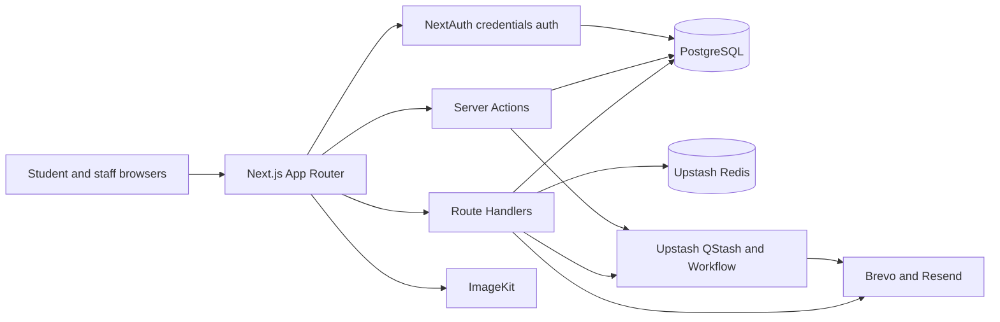

# Mundiapolis Library

Production-grade university library platform for students, faculty, and library staff.

Mundiapolis Library supports authenticated catalog discovery, borrowing requests, renewal workflows, book reviews, admin approvals, circulation operations, fines, reminders, analytics, exports, and deployment-ready production packaging.

## Current Release

- Version: `0.2.1`
- Production URL: `https://mundia-library.vercel.app`
- Release: `https://github.com/AnouarMohamed/Mundia_library/releases/tag/v0.2.1`
- Runtime: Next.js 15 App Router, React 19, TypeScript, Drizzle ORM, PostgreSQL

## Product Scope

The product is built around two primary audiences:

- Students and faculty need fast search, clear availability, low-friction borrowing, renewal requests, reviews, and account history.
- Library staff need reliable operational screens for approvals, returns, fines, account requests, catalog maintenance, reminders, and exports.

The application is not a marketing site. The first-class workflows are catalog discovery, circulation, and admin operations.

## Architecture At A Glance


```mermaid
flowchart LR
  Browser[Student and staff browsers]
  Next[Next.js App Router]
  Auth[NextAuth credentials auth]
  Actions[Server Actions]
  API[Route Handlers]
  DB[(PostgreSQL)]
  Redis[(Upstash Redis)]
  QStash[Upstash QStash and Workflow]
  ImageKit[ImageKit]
  Email[Brevo and Resend]

  Browser --> Next
  Next --> Auth
  Next --> Actions
  Next --> API
  Auth --> DB
  Actions --> DB
  API --> DB
  API --> Redis
  Actions --> QStash
  API --> QStash
  Next --> ImageKit
  QStash --> Email
  API --> Email
```

## Documentation

Start here:

- [Documentation Index](docs/README.md)
- [Architecture](docs/ARCHITECTURE.md)
- [Configuration](docs/CONFIGURATION.md)
- [Development Setup](docs/DEVELOPMENT.md)
- [Deployment](docs/DEPLOYMENT.md)
- [Operations Runbook](docs/OPERATIONS.md)
- [API Reference](docs/API_REFERENCE.md)
- [Data Model](docs/DATA_MODEL.md)
- [Testing and CI](docs/TESTING_AND_CI.md)
- [Release Process](docs/RELEASE_PROCESS.md)
- [Production Readiness](docs/PRODUCTION_READINESS.md)
- [Contributing](CONTRIBUTING.md)
- [Security Policy](SECURITY.md)

Historical performance and CI notes remain in `docs/` and are linked from the documentation index.

## Tech Stack

| Layer | Choice |
| --- | --- |
| Framework | Next.js 15 App Router |
| UI | React 19, Tailwind CSS, Radix UI primitives, lucide-react |
| Language | TypeScript |
| Auth | NextAuth v5 credentials provider with JWT sessions |
| Database | PostgreSQL |
| ORM | Drizzle ORM and drizzle-kit |
| Cache and rate limit | Upstash Redis |
| Background workflow | Upstash QStash and Workflow |
| Images and uploads | ImageKit |
| Email | Brevo primary, Resend fallback |
| Tests | Vitest |
| CI | GitHub Actions |
| Deployment | Vercel, Docker, or standalone Next.js server bundle |

## Quick Start

Prerequisites:

- Node.js 20 for local development and CI parity
- npm
- PostgreSQL, either local or Docker
- Optional service accounts for ImageKit, Upstash, Brevo, and Resend

Install dependencies:

```bash
npm ci
```

Create local configuration:

```bash
cp .env.example .env.local
```

Start PostgreSQL with Docker:

```bash
docker compose up -d db
```

Apply schema and seed data:

```bash
npm run db:migrate
npm run seed
```

Start the app:

```bash
npm run dev
```

Open:

- App: `http://localhost:3000`
- Adminer, when using Docker Compose: `http://localhost:8080`

Seeded local accounts:

| Role | Email | Password |
| --- | --- | --- |
| Student | `test@user.com` | `12345678` |
| Admin | `test@admin.com` | `12345678` |

These accounts are for local development and test environments only.

## Core Commands

| Command | Purpose |
| --- | --- |
| `npm run dev` | Start local Next.js development server |
| `npm run build` | Build the production app |
| `npm run start` | Start the production server after `next build` |
| `npm run lint` | Run ESLint with zero-warning policy |
| `npm run typecheck` | Run TypeScript without emitting files |
| `npm run test` | Run Vitest tests |
| `npm run ci:quality` | Run lint, typecheck, tests, and build |
| `npm run db:migrate` | Apply Drizzle schema changes |
| `npm run db:generate` | Generate Drizzle migration files |
| `npm run db:studio` | Open Drizzle Studio |
| `npm run seed` | Seed books and local test users |
| `npm run benchmark:api` | Benchmark key API routes |
| `npm run loadtest:nightly` | Run the heavier load-test script |

## Production Checklist

Before shipping a release:

- Run `npm run ci:quality`.
- Verify required environment variables in the target environment.
- Apply database schema changes against the target database.
- Confirm an admin account exists and can access `/admin`.
- Confirm public routes, authenticated routes, and admin routes work from a clean browser session.
- Run API benchmarks against a warmed production-like environment.
- Check security workflows and dependency review status.
- Create a release tag and attach package artifacts when needed.

Detailed checklist: [Production Readiness](docs/PRODUCTION_READINESS.md).

## Deployment Options

The app supports three production deployment paths:

1. Vercel, recommended for the current hosted deployment.
2. Docker, using the included `Dockerfile` and `docker-compose.yml`.
3. Standalone package, generated by Next.js `output: "standalone"` and attached to GitHub releases.

See [Deployment](docs/DEPLOYMENT.md) for required environment variables, migration order, and verification steps.

## Security Posture

The app uses:

- Credentials auth with salted password hashes.
- JWT sessions with role claims.
- Narrow `/admin/*` middleware and server-side admin guards.
- API-level authorization checks for user-owned records.
- Upstash-backed rate limiting for public APIs.
- CodeQL, secret scanning, dependency review, npm audit, container scanning, and OpenSSF Scorecard in CI.

Report vulnerabilities through GitHub Security Advisories. See [Security Policy](SECURITY.md).

## Repository Status

This repository is application code, not a public npm library. `package.json` intentionally contains `"private": true`. Release packages are published as GitHub release assets unless the project owner explicitly decides to publish a separate npm package.
