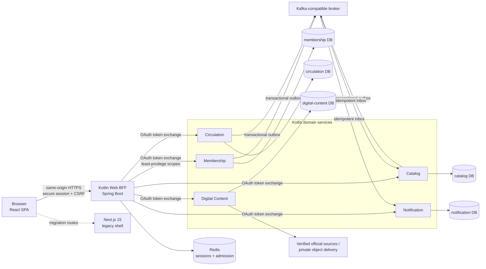

# Mundiapolis Library

> A security-focused university library platform being migrated from a Next.js monolith to a Kotlin/Spring microservice architecture.

[](https://nodejs.org/)
[](https://kotlinlang.org/)
[](https://spring.io/projects/spring-boot)
[](https://www.postgresql.org/)
[](LICENSE)

Mundiapolis Library supports catalog discovery, physical circulation, licensed
learning resources, member administration, notifications, and audited staff
operations. The repository contains both the live Next.js migration shell and
the replacement platform: a static React SPA, a Kotlin Web BFF, five
domain-owned Kotlin services, and an AWS/EKS GitOps foundation.

The service platform is substantial but **not yet the production authority for
every route**. Cutover is deliberately gated by data reconciliation, identity,
load, rollback, disaster-recovery, and security evidence. See
[Production Readiness](docs/PRODUCTION_READINESS.md) for the honest status.

## Current architecture


```mermaid
flowchart LR
  Browser["Browser<br/>React SPA"] -->|"same-origin HTTPS<br/>secure session + CSRF"| BFF["Kotlin Web BFF<br/>Spring Boot"]
  Browser -. "migration routes" .-> Legacy["Next.js 15<br/>legacy shell"]

  subgraph Domain["Kotlin domain services"]
    Membership["Membership"]
    Catalog["Catalog"]
    Circulation["Circulation"]
    Digital["Digital Content"]
    Notification["Notification"]
  end

  BFF -->|"OAuth token exchange<br/>least-privilege scopes"| Membership
  BFF -->|"OAuth token exchange"| Catalog
  BFF -->|"OAuth token exchange"| Circulation
  BFF -->|"OAuth token exchange"| Digital
  BFF -->|"OAuth token exchange"| Notification

  Membership --> MembershipDB[("membership DB")]
  Catalog --> CatalogDB[("catalog DB")]
  Circulation --> CirculationDB[("circulation DB")]
  Digital --> DigitalDB[("digital-content DB")]
  Notification --> NotificationDB[("notification DB")]

  Membership & Catalog & Circulation -->|"transactional outbox"| Kafka["Kafka-compatible broker"]
  Kafka -->|"idempotent inbox"| Catalog & Notification
  BFF --> Redis[("Redis<br/>sessions + admission")]
  Digital --> Sources["Verified official sources /<br/>private object delivery"]
```

The important boundary is the Kotlin BFF: browsers never receive service
credentials or OAuth access tokens. Each domain service owns its schema and
contract. Cross-service state moves through explicit APIs or replay-safe events,
not shared tables. The legacy application remains isolated while strangler
routes are proven and cut over.

Read [Architecture](docs/ARCHITECTURE.md) for request flows, trust boundaries,
data ownership, and migration state.

## Service map

| Runtime | Responsibility | Data authority |
| --- | --- | --- |
| `web-bff` | Browser sessions, CSRF, token exchange, response validation | Redis-backed session state only |
| `membership-service` | Profiles, account state, eligibility, admin membership decisions | Membership PostgreSQL schema |
| `catalog-service` | Works, editions, contributors, search, reviews, learning-resource metadata | Catalog PostgreSQL schema |
| `circulation-service` | Copies, loans, reservations, policies, staff queues and transitions | Circulation PostgreSQL schema |
| `digital-content-service` | Licence evidence, quarantine, asset eligibility, audited download authorization | Digital-content PostgreSQL schema |
| `notification-service` | Inbox, preferences, delivery state, complaint suppression | Notification PostgreSQL schema |
| `web-spa` | Static React user and staff interface | No server-side authority |
| Next.js shell | Current production routes during migration | Legacy PostgreSQL schema |

The new circulation desk exposes live counts and keyset-paginated loan and
reservation queues. Administrative commands are CSRF-protected, idempotent,
scope-restricted, and preceded by a fresh authoritative membership check.

## Product capabilities

- Searchable physical catalog with borrowing, reservations, renewals, reviews,
  history, and availability.
- Large legal learning-resource catalog with licence provenance and official
  source downloads; unclear or restricted records remain quarantined.
- Membership profiles and approval/rejection workflows with `USER`, `ADMIN`,
  and `SUPER_ADMIN` governance roles.
- Staff circulation queues for loan approval/rejection/return and reservation
  fulfilment/expiry.
- Notification inbox, preferences, email delivery controls, and suppression
  handling.
- Immutable OpenAPI contracts, actor-bound idempotency, optimistic concurrency,
  append-only audit records, transactional outbox/inbox processing, and bounded
  pagination.

## Quick start

### Legacy production shell

Requires Node.js 24 LTS (`24.17.0` or newer), npm, and Docker.

```bash
npm ci
cp .env.example .env.local
docker compose up -d db
npm run db:migrate
npm run seed
npm run dev
```

Open `http://localhost:3000`. Local seed credentials are documented only for
development in [Development](docs/DEVELOPMENT.md).

### Kotlin services and SPA

Requires JDK 25 in addition to Node.js and Docker.

```bash
docker compose up -d circulation-db membership-db catalog-db notification-db digital-content-db
cd services && ./gradlew clean check
cd ..
npm run spa:generate
npm run spa:test
```

Local service startup requires a real development OIDC issuer/JWK set. Do not
disable authentication to make an environment appear healthy. Exact variables
and per-service commands are in [Configuration](docs/CONFIGURATION.md) and
[Services](services/README.md).

## Quality gates

The Makefile is the supported local CI interface:

| Command | What it proves |
| --- | --- |
| `make ci-fast` | Contracts, all Kotlin service checks, and web lint/type/test/build gates |
| `make ci` | Push-CI rehearsal including PostgreSQL, migration tooling, platform validation, E2E, image builds, and security scans |
| `make services-ci` | Compile, test, and package all Kotlin services |
| `make spa-ci` | Generate contracts, typecheck, test, and build the SPA |
| `make platform-ci` | Validate Helm, Kubernetes, policy, and GitOps contracts |
| `make images-scan` | Build and scan every deployable image for HIGH/CRITICAL findings |

CI also runs CodeQL, dependency review, secret scanning, npm audit, Trivy, and
OpenSSF Scorecard. Passing automation is necessary evidence, not a substitute
for an external penetration test or a disaster-recovery exercise.

## Deployment

- **Current:** the legacy shell is available at
  [mundialibrary.tech](https://mundialibrary.tech), with the Vercel URL retained
  only as a fallback.
- **Images:** CI publishes the web shell, Web BFF, and five domain services to
  GHCR after blocking gates pass.
- **Target:** AWS with private EKS networking, managed PostgreSQL/Kafka/Redis,
  workload identity, External Secrets, Argo CD, Kyverno, and OpenTelemetry.
- **Status:** `platform/` is a hardened, reviewable foundation; it has not been
  applied to an AWS account and intentionally retains explicit deployment
  blockers.

Deploy immutable image digests, run schema migrations through isolated
least-privilege jobs, and promote the same artifact across environments. Never
commit secrets or place them in image layers.

See [Deployment](docs/DEPLOYMENT.md), [Platform](platform/README.md), and
[Release Process](docs/RELEASE_PROCESS.md).

## Documentation

Start with the [documentation index](docs/README.md):

- [Architecture](docs/ARCHITECTURE.md) — services, data ownership, request and event flows.
- [Development](docs/DEVELOPMENT.md) — workstation setup and change workflow.
- [Configuration](docs/CONFIGURATION.md) — environment and identity contracts.
- [API Reference](docs/API_REFERENCE.md) — legacy routes and Kotlin OpenAPI entry points.
- [Testing and CI](docs/TESTING_AND_CI.md) — local gates and hosted workflows.
- [Operations](docs/OPERATIONS.md) — incidents, recovery, and routine procedures.
- [Threat Model](docs/THREAT_MODEL.md) — assets, adversaries, and mitigations.
- [Production Overhaul](docs/PRODUCTION_OVERHAUL.md) — remaining migration plan.

## Security

Report vulnerabilities through the private process in [SECURITY.md](SECURITY.md).
Do not open a public issue containing credentials, personal data, exploit steps,
or unpatched vulnerability details.

## Licence

Licensed under the [MIT License](LICENSE). Imported learning-resource metadata
and linked content retain their own source licences; inclusion in the catalog
does not relicense third-party material.
