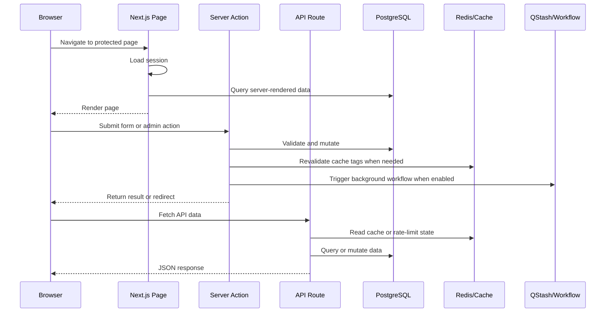
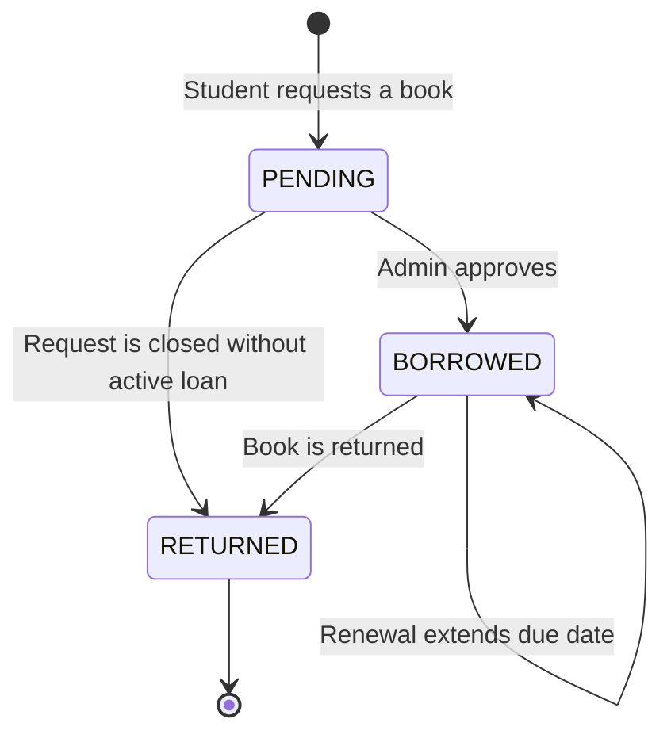

# Architecture

Mundiapolis Library is a full-stack Next.js application. The application combines server-rendered pages, server actions, route handlers, a PostgreSQL database, Redis-backed caching and rate limiting, workflow automation, image uploads, and transactional email.

## Runtime Overview

| Area | Implementation | Notes |
| --- | --- | --- |
| Pages | `app/**/page.tsx` | App Router pages and layouts. |
| Student shell | `app/(root)/layout.tsx` | Requires a signed-in session before rendering student pages. |
| Admin shell | `app/admin/layout.tsx` | Requires authenticated admin access and falls back to DB role lookup for stale sessions. |
| Admin middleware | `middleware.ts` | Restricts `/admin/*` early with JWT token checks. |
| Auth | `auth.ts` | NextAuth v5 credentials provider, JWT sessions, lazy DB imports for Edge compatibility. |
| Server actions | `lib/actions/**`, `lib/admin/actions/**` | Mutations and admin workflows. |
| API routes | `app/api/**/route.ts` | JSON endpoints for catalog, borrows, admin operations, reviews, notifications, uploads, and workflows. |
| Database | `database/drizzle.ts`, `database/schema.ts` | Drizzle ORM over PostgreSQL. Local hostnames use `pg`; remote URLs use Neon HTTP driver. |
| Cache | `lib/cache/**`, `database/redis.ts` | Upstash Redis plus Next.js cache tags for selected read paths. |
| Background work | `lib/workflow.ts` | Upstash QStash and Workflow clients. |
| Email | `lib/services/email-service.ts` | Brevo primary provider with Resend fallback for selected email flows. |
| Images | `app/api/auth/imagekit/route.ts` | ImageKit auth parameter endpoint for uploads. |

## Request Flow



## Authentication And Authorization

Authentication uses credentials sign-in through NextAuth. Passwords are stored as salted SHA-256 hashes in the current implementation.

Important files:

- `auth.ts`: credentials provider, password verification, JWT session claims.
- `lib/session.ts`: session helper used by layouts and server components.
- `middleware.ts`: narrow admin route middleware.
- `lib/admin/route-guard.ts`: reusable guard for admin API routes.
- `app/(root)/layout.tsx`: redirects unauthenticated users to `/sign-in`.
- `app/admin/layout.tsx`: requires admin role and redirects non-admin users to `/`.

Role model:

| Role | Access |
| --- | --- |
| `USER` | Student and faculty workflows: browse, borrow, renew, review, view own history. |
| `ADMIN` | All user workflows plus admin dashboard, catalog, approvals, reminders, exports, and user management. |

Account status model:

| Status | Meaning |
| --- | --- |
| `PENDING` | Account created but not approved. |
| `APPROVED` | Account can use the system. |
| `REJECTED` | Account was denied by an administrator. |

## Borrow Lifecycle

Borrowing is tracked in `borrow_records`.



Operational meaning:

- `PENDING`: request is waiting for staff action.
- `BORROWED`: user currently has the book.
- `RETURNED`: circulation cycle is closed.

Availability is stored on `books.availableCopies`. Mutations that approve or return books must keep this value synchronized with `borrow_records`.

## Data Access Strategy

`database/drizzle.ts` chooses the database driver based on `DATABASE_URL`:

- Local hosts such as `localhost`, `127.0.0.1`, `db`, and `postgres` use `pg` with a pooled Node Postgres client.
- Remote PostgreSQL URLs use the Neon serverless driver.

This lets local Docker and CI use a normal PostgreSQL container while hosted environments can use a serverless-friendly connection path.

## Caching Strategy

The catalog read path has two cache layers:

- Next.js `unstable_cache` with cache tags such as `books` and `recommendations`.
- Upstash Redis stale-while-revalidate helpers in `lib/cache/redis-cache.ts`.

Mutation paths should invalidate cache tags through `lib/cache/revalidate.ts`.

Current cache-sensitive areas:

- `GET /api/books`
- `GET /api/books/genres`
- `GET /api/books/recommendations`
- Admin catalog mutations
- Borrow mutations that affect availability
- Recommendation refresh operations

## Rate Limiting

`lib/ratelimit.ts` defines a shared fixed-window limiter:

- Default: 200 requests per minute per identifier.
- Backend: Upstash Redis.
- Development behavior: bypassed outside production, when `DISABLE_RATE_LIMIT=true`, or when Redis config is missing.

Production should have valid `UPSTASH_REDIS_URL` and `UPSTASH_REDIS_TOKEN`.

## Background Workflow And Email

Workflow code lives in `lib/workflow.ts`. It uses Upstash QStash and Workflow for background orchestration.

Email delivery exists in two forms:

- `lib/services/email-service.ts`: Brevo primary, Resend fallback.
- `lib/workflow.ts`: QStash email publishing with Resend provider.

Production should decide which path owns each email class and keep sender identity aligned with the Mundiapolis Library brand.

## Route Groups

| Route group | Purpose |
| --- | --- |
| `app/(auth)` | Sign-in and sign-up pages. |
| `app/(root)` | Authenticated student and faculty experience. |
| `app/admin` | Admin circulation, catalog, automation, and user management. |
| `app/api` | JSON API and integration endpoints. |

## Admin Operations Surface

The admin area currently includes:

- Dashboard overview: `app/admin/page.tsx`
- Users: `app/admin/users/page.tsx`
- Books: `app/admin/books/page.tsx`
- Add book: `app/admin/books/new/page.tsx`
- Edit book: `app/admin/books/[id]/edit/page.tsx`
- Borrow requests: `app/admin/book-requests/page.tsx`
- Renewal requests: `app/admin/renewal-requests/page.tsx`
- Account requests: `app/admin/account-requests/page.tsx`
- Automation: `app/admin/automation/page.tsx`

## Production Deployment Shape

Next.js standalone output is enabled in `next.config.mjs`:

```js
output: "standalone"
```

This supports:

- Vercel deployment.
- Docker runtime image.
- GitHub release assets containing a standalone production bundle.

## Known Architectural Risks

Track these before calling the product mature at institutional scale:

- Legacy salted SHA-256 password hashes are still supported for verification, but successful logins are lazily rehashed to the current bcrypt format.
- Some workflows use multiple email abstractions. Standardize ownership before expanding notification volume.
- Admin and student authorization should use the centralized guards in `lib/security/auth-guards.ts`; new routes must explicitly choose the correct guard.
- `migrations/postgres` is the canonical migration path. `migrations/legacy-mysql` is archived reference only.
