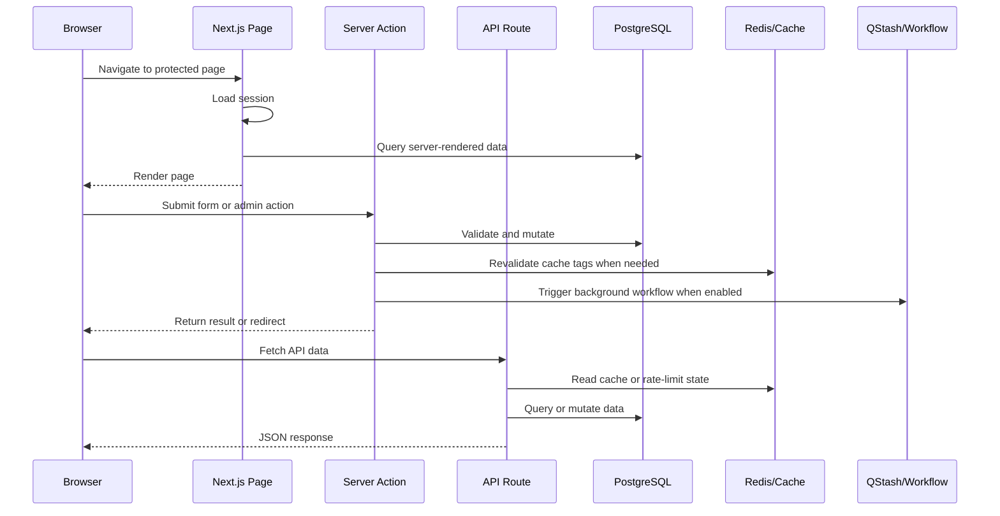
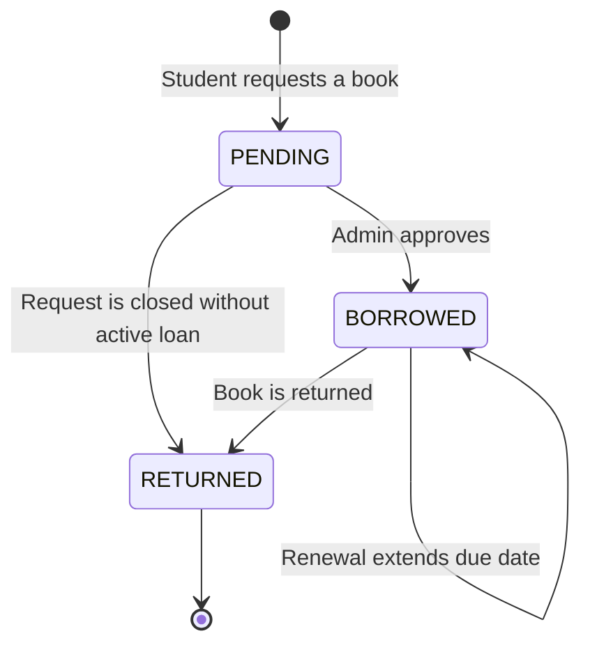

# Architecture

Mundiapolis Library is a full-stack Next.js application. The application combines server-rendered pages, server actions, route handlers, a PostgreSQL database, Redis-backed caching and rate limiting, workflow automation, image uploads, and transactional email.

## Runtime Overview

| Area             | Implementation                              | Notes                                                                                                        |
| ---------------- | ------------------------------------------- | ------------------------------------------------------------------------------------------------------------ |
| Pages            | `app/**/page.tsx`                           | App Router pages and layouts.                                                                                |
| Student shell    | `app/(root)/layout.tsx`                     | Requires a signed-in session before rendering student pages.                                                 |
| Admin shell      | `app/admin/layout.tsx`                      | Requires authenticated admin access and falls back to DB role lookup for stale sessions.                     |
| Admin middleware | `middleware.ts`                             | Prefilters `/admin/*` for session-cookie presence; the server layout is the authoritative role/status guard. |
| Auth             | `auth.ts`                                   | NextAuth v5 credentials provider, JWT sessions, lazy DB imports for Edge compatibility.                      |
| Server actions   | `lib/actions/**`, `lib/admin/actions/**`    | Mutations and admin workflows.                                                                               |
| API routes       | `app/api/**/route.ts`                       | JSON endpoints for catalog, borrows, admin operations, reviews, notifications, uploads, and workflows.       |
| Database         | `database/drizzle.ts`, `database/schema.ts` | Drizzle ORM over a transaction-capable `pg` pool in every environment.                                       |
| Cache            | `lib/cache/**`, `database/redis.ts`         | Upstash Redis plus Next.js cache tags for selected read paths.                                               |
| Background work  | `lib/workflow.ts`                           | Upstash QStash and Workflow clients.                                                                         |
| Email            | `lib/services/email-service.ts`             | Brevo primary provider with Resend fallback for selected email flows.                                        |
| Uploads          | `app/api/uploads/route.ts`                  | Server-mediated, policy-bound uploads; the legacy client-signing route is retired.                           |
| Health           | `app/api/health`, `app/api/health/live`     | Dependency-aware readiness plus a process-only liveness probe.                                               |

## Request Flow


```mermaid
sequenceDiagram
  participant B as Browser
  participant P as Next.js Page
  participant A as Server Action
  participant R as API Route
  participant DB as PostgreSQL
  participant C as Redis/Cache
  participant W as QStash/Workflow

  B->>P: Navigate to protected page
  P->>P: Load session
  P->>DB: Query server-rendered data
  P-->>B: Render page

  B->>A: Submit form or admin action
  A->>DB: Validate and mutate
  A->>C: Revalidate cache tags when needed
  A->>W: Trigger background workflow when enabled
  A-->>B: Return result or redirect

  B->>R: Fetch API data
  R->>C: Read cache or rate-limit state
  R->>DB: Query or mutate data
  R-->>B: JSON response
```

## Authentication And Authorization

Authentication currently uses credentials sign-in through NextAuth while the
managed OIDC migration is in progress. New passwords use bcrypt; successful
verification of a legacy SHA-256 record rewrites it to bcrypt.

Important files:

- `auth.ts`: credentials provider, password verification, JWT session claims.
- `lib/session.ts`: session helper used by layouts and server components.
- `middleware.ts`: narrow admin route middleware.
- `lib/admin/route-guard.ts`: reusable guard for admin API routes.
- `app/(root)/layout.tsx`: redirects unauthenticated users to `/sign-in`.
- `app/admin/layout.tsx`: requires admin role and redirects non-admin users to `/`.

Role model:

| Role    | Access                                                                                                |
| ------- | ----------------------------------------------------------------------------------------------------- |
| `USER`  | Student and faculty workflows: browse, borrow, renew, review, view own history.                       |
| `ADMIN` | All user workflows plus admin dashboard, catalog, approvals, reminders, exports, and user management. |

Account status model:

| Status     | Meaning                                 |
| ---------- | --------------------------------------- |
| `PENDING`  | Account created but not approved.       |
| `APPROVED` | Account can use the system.             |
| `REJECTED` | Account was denied by an administrator. |

## Borrow Lifecycle

Borrowing is tracked in `borrow_records`.


```mermaid
stateDiagram-v2
  [*] --> PENDING: Student requests a book
  PENDING --> BORROWED: Admin approves
  PENDING --> RETURNED: Request is closed without active loan
  BORROWED --> RETURNED: Book is returned
  BORROWED --> BORROWED: Renewal extends due date
  RETURNED --> [*]
```

Operational meaning:

- `PENDING`: request is waiting for staff action.
- `BORROWED`: user currently has the book.
- `RETURNED`: circulation cycle is closed.

Availability is stored on `books.availableCopies`. Mutations that approve or return books must keep this value synchronized with `borrow_records`.

## Data Access Strategy

`database/drizzle.ts` uses the transaction-capable `pg` driver in every
environment. The pool has bounded connection, statement, query, idle, and
idle-in-transaction budgets. Hosted deployments should use a managed pooled
PostgreSQL endpoint or PgBouncer and budget the per-process pool against the
database connection limit.

## Caching Strategy

The catalog read path has two cache layers:

- Next.js `unstable_cache` with cache tags such as `books` and `recommendations`.
- Upstash Redis stale-while-revalidate helpers in `lib/cache/redis-cache.ts`.

Mutation paths should invalidate cache tags through `lib/cache/revalidate.ts`.

Current cache-sensitive areas:

- `GET /api/books`
- `GET /api/books/genres`
- `GET /api/books/recommendations`
- Admin catalog mutations
- Borrow mutations that affect availability
- Recommendation refresh operations

## Rate Limiting

The Node.js request-boundary middleware admits every API request and every
mutating page request, including Server Actions, before application code runs.
Health probes and CORS preflight are dependency-free exceptions. Fixed-window
budgets are separated by risk: 300 reads, 120 commands, and 30 sensitive
operations per trusted ingress identity per minute. Authentication then adds
stricter account and IP budgets around credential verification.

`lib/ratelimit.ts` selects Upstash Redis or the atomic PostgreSQL fallback.
Identifiers are SHA-256 pseudonyms, counters are capped at `limit + 1`, and
protected tiers fail closed with 503 when admission state is unavailable.
Limit exhaustion returns 429 with `RateLimit-*` and `Retry-After` metadata.
Only development and test may bypass missing local limiter infrastructure.

## Background Workflow And Email

Workflow code lives in `lib/workflow.ts`. It uses Upstash QStash and Workflow for background orchestration.

Email delivery exists in two forms:

- `lib/services/email-service.ts`: Brevo primary, Resend fallback.
- `lib/workflow.ts`: QStash email publishing with Resend provider.

Production should decide which path owns each email class and keep sender identity aligned with the Mundiapolis Library brand.

## Route Groups

| Route group  | Purpose                                                      |
| ------------ | ------------------------------------------------------------ |
| `app/(auth)` | Sign-in and sign-up pages.                                   |
| `app/(root)` | Authenticated student and faculty experience.                |
| `app/admin`  | Admin circulation, catalog, automation, and user management. |
| `app/api`    | JSON API and integration endpoints.                          |

## Admin Operations Surface

The admin area currently includes:

- Dashboard overview: `app/admin/page.tsx`
- Users: `app/admin/users/page.tsx`
- Books: `app/admin/books/page.tsx`
- Add book: `app/admin/books/new/page.tsx`
- Edit book: `app/admin/books/[id]/edit/page.tsx`
- Borrow requests: `app/admin/book-requests/page.tsx`
- Renewal requests: `app/admin/renewal-requests/page.tsx`
- Account requests: `app/admin/account-requests/page.tsx`
- Automation: `app/admin/automation/page.tsx`

## Production Deployment Shape

Next.js standalone output is enabled in `next.config.mjs`:

```js
output: "standalone";
```

This supports:

- Vercel deployment.
- Docker runtime image.
- GitHub release assets containing a standalone production bundle.

## Known Architectural Risks

Track these before calling the product mature at institutional scale:

- Legacy salted SHA-256 password hashes are still supported for verification, but successful logins are lazily rehashed to the current bcrypt format.
- Some workflows use multiple email abstractions. Standardize ownership before expanding notification volume.
- Admin and student authorization should use the centralized guards in `lib/security/auth-guards.ts`; new routes must explicitly choose the correct guard.
- `migrations/postgres` is the canonical migration path. `migrations/legacy-mysql` is archived reference only.
