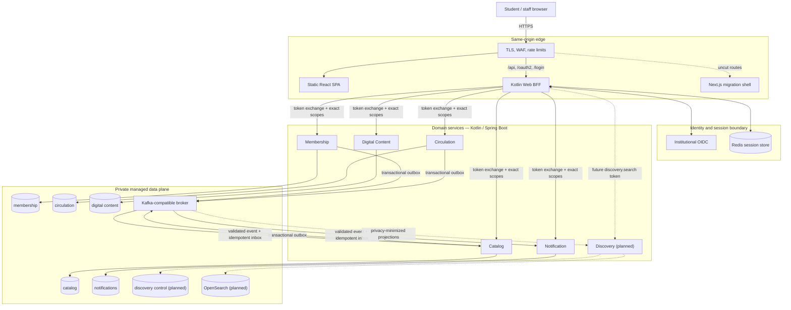
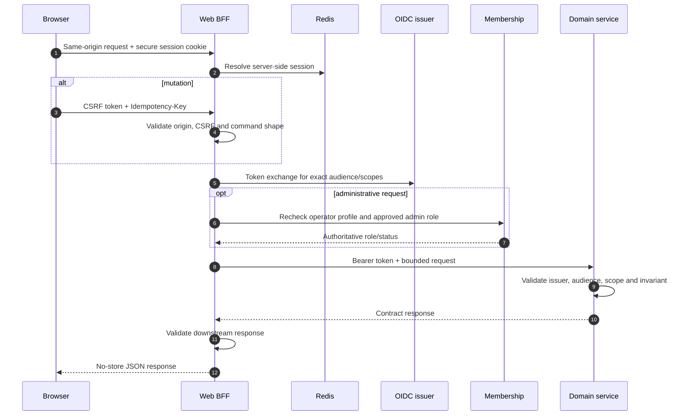
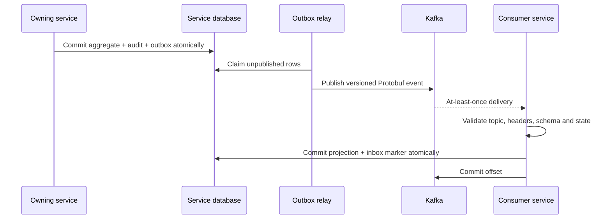

# Architecture

Mundiapolis Library is in a controlled strangler migration. The current Vercel
deployment still serves the Next.js application, while new product slices are
implemented as a static React SPA behind a Kotlin Web BFF and five implemented
domain-owned Kotlin/Spring services. A sixth Search and Discovery boundary is
accepted and reserved but intentionally not implemented. This document
distinguishes implemented code from future deployment state.

## Architecture at a glance

```mermaid
flowchart TB
  User["Student / staff browser"]

  subgraph Edge["Same-origin edge"]
    WAF["TLS, WAF, rate limits"]
    SPA["Static React SPA"]
    BFF["Kotlin Web BFF"]
    Legacy["Next.js migration shell"]
  end

  subgraph Identity["Identity and session boundary"]
    OIDC["Institutional OIDC"]
    Session[("Redis session store")]
  end

  subgraph Services["Domain services — Kotlin / Spring Boot"]
    Membership["Membership"]
    Catalog["Catalog"]
    Circulation["Circulation"]
    Digital["Digital Content"]
    Notification["Notification"]
    Discovery["Discovery (planned)"]
  end

  subgraph Data["Private managed data plane"]
    MembershipDB[("membership")]
    CatalogDB[("catalog")]
    CirculationDB[("circulation")]
    DigitalDB[("digital content")]
    NotificationDB[("notifications")]
    DiscoveryDB[("discovery control (planned)")]
    Kafka["Kafka-compatible broker"]
    Search[("OpenSearch (planned)")]
  end

  User -->|"HTTPS"| WAF
  WAF --> SPA
  WAF -->|"/api, /oauth2, /login"| BFF
  WAF -. "uncut routes" .-> Legacy
  BFF <--> Session
  BFF <--> OIDC
  BFF -->|"token exchange + exact scopes"| Membership & Catalog & Circulation & Digital & Notification
  BFF -. "future discovery.search token" .-> Discovery

  Membership --> MembershipDB
  Catalog --> CatalogDB
  Circulation --> CirculationDB
  Digital --> DigitalDB
  Notification --> NotificationDB
  Discovery -.-> DiscoveryDB
  Discovery -.-> Search
  Membership & Catalog & Circulation -->|"transactional outbox"| Kafka
  Kafka -->|"validated event + idempotent inbox"| Catalog & Notification
  Kafka -. "privacy-minimized projections" .-> Discovery
```

### What is authoritative today

| Area | Current authority | Replacement status |
| --- | --- | --- |
| Production browser entry | Next.js on Vercel | SPA/BFF slices exist behind feature and cutover gates |
| Legacy users, books, loans | Legacy PostgreSQL | Reconciliation and route-by-route migration in progress |
| New service aggregates | Owning service PostgreSQL schema | Implemented with Flyway and jOOQ |
| Deployment platform | Vercel plus CI-built containers | AWS/EKS foundation exists but is not deployed |

This is not yet a fully cut-over microservice production system. It is a real
microservice implementation coexisting with the legacy authority until the
documented gates pass.

## Responsibilities and ownership

| Component | Owns | Must not own |
| --- | --- | --- |
| Web BFF | Browser session, CSRF, OAuth token exchange, downstream validation | Domain records, browser-visible access tokens |
| Membership | Member profile, status, role, eligibility inputs, identity-evidence metadata | Loans, catalog metadata, file assets |
| Catalog | Works, editions, contributors, reviews, learning-resource metadata; temporary PostgreSQL search | Physical copy truth, download authorization, final search ranking/index |
| Circulation | Copies, loans, reservations, policy revisions, operational queues | Member identity authority, bibliographic content |
| Digital Content | Licence evidence, quarantine, asset manifests, scan/publication state, download authorization | Catalog search, unverified file hosting |
| Notification | Inbox, preferences, delivery attempts, provider suppression state | Source domain aggregates |
| Discovery (planned) | Disposable search projections, OpenSearch mappings, ranking, facets, suggestions, reindex control | Source aggregates, member behavior, borrowing/download authorization |
| SPA | Presentation and accessible interaction | Secrets, OAuth tokens, authorization decisions |
| Next.js shell | Routes not yet cut over | New service-owned schemas |

Each Kotlin service has an independent Flyway migration chain and database
credential. No service reads another service's tables. Derived state is
versioned and recoverable from APIs or events.

Catalog staff writes follow the same zero-trust browser boundary as Circulation:
the BFF verifies the live Membership administrator record, exchanges into a
separate `catalog.manage` token, and forwards only bounded metadata commands.
Catalog commits the aggregate, audit evidence, idempotent replay snapshot, and
outbox event in one transaction. Edition activation changes discovery state;
it cannot mutate the Circulation-owned copy projection.

## Browser request flow

```mermaid
sequenceDiagram
  autonumber
  participant U as Browser
  participant B as Web BFF
  participant R as Redis
  participant I as OIDC issuer
  participant M as Membership
  participant D as Domain service

  U->>B: Same-origin request + secure session cookie
  B->>R: Resolve server-side session
  alt mutation
    U->>B: CSRF token + Idempotency-Key
    B->>B: Validate origin, CSRF and command shape
  end
  B->>I: Token exchange for exact audience/scopes
  opt administrative request
    B->>M: Recheck operator profile and approved admin role
    M-->>B: Authoritative role/status
  end
  B->>D: Bearer token + bounded request
  D->>D: Validate issuer, audience, scope and invariant
  D-->>B: Contract response
  B->>B: Validate downstream response
  B-->>U: No-store JSON response
```

The BFF uses separate OAuth client registrations where privilege differs. The
circulation administration registration is distinct from self-service and is
limited to read/approve/reject/return/fulfil/expire scopes. Downstream 401/403
responses invalidate the relevant exchanged-token cache rather than silently
falling back.

## Circulation administration

The current administration slice is intentionally narrow:

- `GET /api/v1/circulation/admin/overview` returns live operational counts.
- `GET /api/v1/circulation/admin/loans` returns bounded, status-filtered,
  keyset-paginated loan queues.
- `GET /api/v1/circulation/admin/reservations` does the same for reservations.
- Existing aggregate commands perform loan approval/rejection/return and
  reservation fulfilment/expiry with actor-bound idempotency.
- The BFF rechecks the operator's current Membership record before every admin
  read or command.
- The SPA resolves edition titles through Catalog and presents explicit
  confirmation panels before workflow changes.

Queue indexes follow `(status, event_time DESC, id DESC)` so stable paging does
not degrade to offset scans as history grows.

## Event flow and consistency

```mermaid
sequenceDiagram
  participant API as Owning service
  participant DB as Service database
  participant Relay as Outbox relay
  participant K as Kafka
  participant Consumer as Consumer service

  API->>DB: Commit aggregate + audit + outbox atomically
  Relay->>DB: Claim unpublished rows
  Relay->>K: Publish versioned Protobuf event
  K-->>Consumer: At-least-once delivery
  Consumer->>Consumer: Validate topic, headers, schema and state
  Consumer->>DB: Commit projection + inbox marker atomically
  Consumer->>K: Commit offset
```

Delivery is at least once. Correctness comes from immutable event identity,
aggregate versions, idempotent inboxes, and transaction boundaries—not from an
assumption that Kafka delivers exactly once end to end. Consumers can be rebuilt
from authoritative state and event history.

Discovery is an accepted future boundary, not deployed code. Catalog remains
the search provider until Discovery passes the snapshot/replay, shadow,
relevance, security, performance, and rollback gates in the
[implementation handoff](SEARCH_DISCOVERY_SERVICE.md). Discovery must not read
service databases or the member-bearing Circulation topic.

## Data and command invariants

- Copy availability changes only through Circulation transactions.
- Loan and reservation transitions are explicit state-machine operations.
- Administrative and high-risk commands require a unique actor-bound
  `Idempotency-Key`; stale optimistic versions fail rather than overwrite.
- Mutable aggregate writes commit their audit/outbox evidence atomically.
- List APIs use bounded limits and deterministic tie-breakers.
- Catalog metadata never grants file access. Digital Content independently
  verifies licence, territory, scan, publication, and asset state.
- Unclear, non-commercial-only, or copyrighted learning resources remain
  quarantined and hidden.

## Security boundaries

1. **Internet to edge:** TLS, WAF/DDoS controls, request budgets, and a single
   canonical origin.
2. **Browser to BFF:** `Secure`, `HttpOnly`, same-site session cookies; CSRF and
   origin checks on mutations; no OAuth token in browser storage.
3. **BFF to services:** audience-bound JWTs, exact scopes, bounded timeouts, and
   strict response parsing.
4. **Service to data plane:** private networking, workload identity, separate
   runtime/migration credentials, TLS, and service-owned schemas.
5. **Event boundary:** authenticated broker clients, schema validation,
   aggregate ordering, replay-safe consumers, and privacy-minimized payloads.
6. **Content boundary:** allowlisted HTTPS origins, canonical URLs, verified
   licence evidence, malware state, short-lived signed delivery, and audit.

Authorization is enforced at the service even when the edge or BFF has already
checked it. Network placement is not treated as authorization.

## Resilience and scaling

- Stateless services can scale horizontally; readiness excludes unavailable
  instances before traffic reaches them.
- PostgreSQL pools and query limits are bounded. Production connection budgets
  must be calculated across maximum replicas.
- Redis state is ephemeral; authoritative domain data stays in PostgreSQL.
- Kafka consumers use independent groups and replay-safe inboxes.
- Queue/search endpoints are indexed and keyset paginated.
- Kubernetes definitions include disruption budgets, topology spread,
  autoscaling, resource limits, NetworkPolicies, and restricted pod security.
- OpenTelemetry is the vendor-neutral telemetry boundary.

## Deployment topology

The target platform is AWS EKS in private subnets with managed PostgreSQL,
Kafka, Redis, object storage, search, KMS, and Secrets Manager. Argo CD owns
cluster state; External Secrets and workload identity provide secret delivery;
Kyverno enforces workload policies. Migrations run as isolated PreSync jobs
using a dedicated credential and the exact application image digest.

The code under `platform/` is a deployment foundation, not evidence of a live
AWS environment. Regions, accounts, add-on versions, domains, image digests,
backups, identity configuration, load results, penetration testing, and recovery
drills remain explicit release decisions.

## Migration and cutover rule

A route moves from the Next.js shell only after:

1. authoritative data is backfilled and reconciled;
2. OpenAPI and browser behavior reach parity;
3. security, load, and failure-mode checks pass;
4. dashboards and alerts exist;
5. rollback is rehearsed without dual writes; and
6. the same tested artifact is promoted by digest.

Feature flags are migration controls, not permanent architecture. Remove the
legacy route only after the observation window succeeds.

## Related decisions

- [ADR 0001 — backend platform stack](adr/0001-backend-platform-stack.md)
- [ADR 0002 — service boundaries and data ownership](adr/0002-service-boundaries-and-data-ownership.md)
- [ADR 0003 — static SPA and Kotlin BFF](adr/0003-static-spa-and-kotlin-bff.md)
- [ADR 0004 — Search and Discovery boundary](adr/0004-search-and-discovery-service.md)
- [Search and Discovery implementation handoff](SEARCH_DISCOVERY_SERVICE.md)
- [Production overhaul](PRODUCTION_OVERHAUL.md)
- [Threat model](THREAT_MODEL.md)
- [AWS/Kubernetes platform](../platform/README.md)
