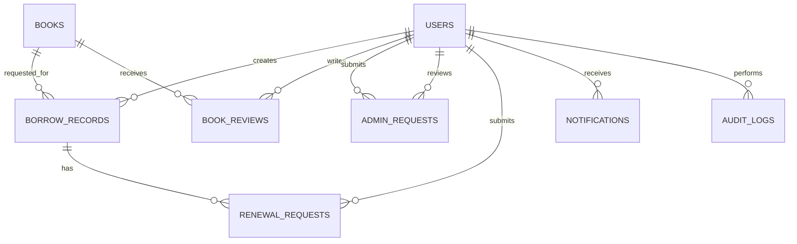

# Data Model

The canonical schema is defined in `database/schema.ts` with Drizzle ORM. The production database is PostgreSQL.

## Entity Overview



## Enums

### `user_status`

| Value | Meaning |
| --- | --- |
| `PENDING` | Account was created and awaits admin approval. |
| `APPROVED` | Account is allowed to use normal product features. |
| `REJECTED` | Account was denied. |

### `user_role`

| Value | Meaning |
| --- | --- |
| `USER` | Student or faculty user. |
| `ADMIN` | Library staff or administrator. |

### `borrow_status`

| Value | Meaning |
| --- | --- |
| `PENDING` | Borrow request submitted, waiting for staff. |
| `BORROWED` | Book is currently checked out. |
| `RETURNED` | Book has been returned or request is closed. |

### `request_status`

| Value | Meaning |
| --- | --- |
| `PENDING` | Request awaits staff decision. |
| `APPROVED` | Request was accepted. |
| `REJECTED` | Request was denied. |

### `notification_type`

| Value | Meaning |
| --- | --- |
| `INFO` | Neutral notification. |
| `SUCCESS` | Positive completion. |
| `WARNING` | Action or attention needed. |
| `ERROR` | Failure or blocked state. |

## Tables

### `users`

Stores students, faculty, and admins.

Important columns:

| Column | Purpose |
| --- | --- |
| `id` | UUID string primary key. |
| `full_name` | Display and identity name. |
| `email` | Login email, unique. |
| `university_id` | University identifier, unique. |
| `password` | Salted password hash. |
| `university_card` | Uploaded card reference. |
| `status` | Account approval state. |
| `role` | `USER` or `ADMIN`. |
| `last_activity_date` | Activity tracking. |
| `last_login` | Last successful sign-in timestamp. |
| `created_at` | Record creation timestamp. |

Production notes:

- Do not expose password hashes.
- Treat university card references as sensitive.
- Role changes should be audited.

### `books`

Stores catalog records.

Important columns:

| Column | Purpose |
| --- | --- |
| `id` | UUID string primary key. |
| `title` | Book title. |
| `author` | Author names. |
| `genre` | Genre/category label. |
| `rating` | Stored rating value. |
| `cover_url` | Cover image URL. |
| `cover_color` | UI placeholder color. |
| `description` | Long description. |
| `summary` | Short summary. |
| `total_copies` | Owned physical copy count. |
| `available_copies` | Copies currently available. |
| `video_url` | Optional video URL. |
| `isbn` | ISBN. |
| `publication_year` | Publication year. |
| `publisher` | Publisher name. |
| `language` | Primary language. |
| `page_count` | Number of pages. |
| `edition` | Edition information. |
| `is_active` | Soft-delete or visibility flag. |
| `updated_by` | Admin who last updated record. |

Production notes:

- Public catalog reads should filter `is_active = true`.
- Keep `available_copies <= total_copies`.
- Book mutations should revalidate `books` and recommendation caches.

### `borrow_records`

Tracks borrowing lifecycle.

Important columns:

| Column | Purpose |
| --- | --- |
| `id` | UUID string primary key. |
| `user_id` | Borrowing user. |
| `book_id` | Borrowed book. |
| `borrow_date` | Request or approval timestamp. |
| `due_date` | Expected return date. |
| `return_date` | Actual return date. |
| `status` | Borrow lifecycle state. |
| `borrowed_by` | Staff/system actor for checkout. |
| `returned_by` | Staff/system actor for return. |
| `fine_amount` | Accumulated overdue fine. |
| `notes` | Admin or workflow notes. |
| `renewal_count` | Number of accepted renewals. |
| `last_reminder_sent` | Last reminder timestamp. |
| `updated_by` | Last actor. |

Production notes:

- Non-admin users must only see their own records.
- Approval and return actions must keep book copy counts synchronized.
- Overdue logic should be deterministic and auditable.

### `system_config`

Stores application-wide settings such as fine rates.

Important columns:

| Column | Purpose |
| --- | --- |
| `key` | Unique configuration key. |
| `value` | Serialized configuration value. |
| `description` | Human-readable purpose. |
| `updated_by` | Actor who changed it. |

Production notes:

- Treat changes as operational events.
- Validate values before saving.

### `book_reviews`

Stores user reviews for books.

Important columns:

| Column | Purpose |
| --- | --- |
| `book_id` | Reviewed book. |
| `user_id` | Review author. |
| `rating` | Numeric rating. |
| `comment` | Review text. |
| `created_at` | Creation timestamp. |
| `updated_at` | Last update timestamp. |

Production notes:

- Eligibility should be based on borrow history.
- Users should not edit or delete reviews they do not own unless admin behavior is explicitly implemented.

### `admin_requests`

Stores requests for administrative privileges or account status changes.

Important columns:

| Column | Purpose |
| --- | --- |
| `user_id` | Requesting user. |
| `request_reason` | User-provided reason. |
| `status` | Review status. |
| `reviewed_by` | Admin reviewer. |
| `reviewed_at` | Review timestamp. |
| `rejection_reason` | Reason for denial. |

Production notes:

- Admin promotions should be rare and audited.
- Rejections should provide enough context for the requester.

### `audit_logs`

Stores sensitive or critical action history.

Important columns:

| Column | Purpose |
| --- | --- |
| `user_id` | Actor. |
| `action` | Action name. |
| `target_id` | Affected entity ID. |
| `target_type` | Affected entity type. |
| `details` | JSON-serialized detail. |

Production notes:

- Use this table for privilege changes, destructive catalog actions, and sensitive admin operations.
- Do not store secrets in `details`.

### `renewal_requests`

Stores requests to extend due dates.

Important columns:

| Column | Purpose |
| --- | --- |
| `borrow_record_id` | Borrow record being renewed. |
| `user_id` | Requesting user. |
| `status` | Review status. |
| `request_reason` | User-provided reason. |
| `rejection_reason` | Admin-provided rejection context. |

Production notes:

- Renewal approval should update `borrow_records.due_date` and increment `renewal_count`.
- Prevent duplicate pending renewal requests for the same active loan.

### `notifications`

Stores in-app notifications.

Important columns:

| Column | Purpose |
| --- | --- |
| `user_id` | Recipient. |
| `title` | Short title. |
| `message` | Notification body. |
| `type` | UI severity. |
| `is_read` | Read state. |

Production notes:

- Notification content should not expose sensitive admin-only details.

## Borrow Data Invariants

Maintain these invariants:

- `books.available_copies` must never be negative.
- `books.available_copies` must not exceed `books.total_copies`.
- A `BORROWED` record should have a `due_date`.
- A `RETURNED` record should have a `return_date`.
- A user should not have duplicate active borrow records for the same physical book unless policy explicitly allows multiple copies.
- Fine updates should not double-charge for the same day.

## Migration Workflow

For development:

```bash
npm run db:generate
npm run db:migrate
```

For production:

1. Review schema change and generated SQL.
2. Confirm backup or restore point.
3. Prefer additive changes.
4. Apply migration against production database from a controlled environment.
5. Deploy code.
6. Verify key reads and writes.

## Seed Data

Seed script:

- `database/seed.ts`

Data source:

- `dummybooks.json`

Seeded accounts:

| Role | Email | Password |
| --- | --- | --- |
| Student | `test@user.com` | `12345678` |
| Admin | `test@admin.com` | `12345678` |

Seed data is for local development and CI-like environments. Do not run test-user seed data against production unless you intentionally want those accounts.

## Data Access Files

| File | Purpose |
| --- | --- |
| `database/schema.ts` | Table and enum definitions. |
| `database/drizzle.ts` | Drizzle client setup and driver selection. |
| `drizzle.config.ts` | Drizzle Kit configuration. |
| `database/seed.ts` | Seed books and local accounts. |
| `database/migrate-from-csv.ts` | CSV migration path. |
| `scripts/add-performance-indexes.ts` | Adds performance indexes. |
| `scripts/explain-hot-queries.ts` | Query plan diagnostics. |
| `scripts/verify-borrow-details.ts` | Borrow detail verification. |
| `scripts/fix-borrow-sync.ts` | Borrow/copy synchronization repair helper. |

## Schema Change Review Checklist

- Does the change preserve existing production data?
- Is the migration additive or destructive?
- Are nullable defaults handled?
- Are foreign keys and indexes appropriate?
- Does the change affect API response shape?
- Does the change affect admin exports?
- Are cache invalidation points updated?
- Are seed data and tests updated?
- Is rollback or roll-forward plan documented?
