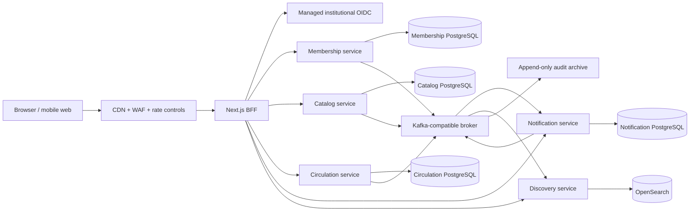

# Production overhaul

Status: **approved architecture; migration in progress; production release held**

This document is the execution contract for turning Mundiapolis Library into a
high-availability product. It deliberately does not use “perfect” or “secure”
as unverifiable acceptance criteria. A release is acceptable only when the
measurable security, correctness, performance, recovery, and operational gates
below pass.

## Executive decision

Keep the Next.js application as the web frontend and backend-for-frontend (BFF)
during a strangler migration. Move business capabilities into a small set of
Kotlin/Spring services. PostgreSQL remains the authoritative database. This is
not a rewrite into dozens of services and it is not a big-bang cutover.

The target platform is:

| Concern         | Decision                                                                   |
| --------------- | -------------------------------------------------------------------------- |
| Web/BFF         | Next.js 15 during migration; browser receives only secure BFF cookies      |
| Services        | Kotlin 2.3, Spring Boot 4.1, JDK 25, Spring MVC with virtual threads       |
| Persistence     | PostgreSQL 18, one owned database/schema and credentials per service       |
| SQL/migrations  | jOOQ-generated types and Flyway forward migrations                         |
| Identity        | Managed institutional OIDC with authorization-code flow and PKCE           |
| Events          | Kafka-compatible managed broker, Protobuf contracts, transactional outbox  |
| Ephemeral state | Redis for bounded cache, rate limits, locks, and idempotency acceleration  |
| Search          | OpenSearch read model fed by versioned domain events                       |
| Runtime         | Managed Kubernetes, managed stateful services, Terraform, Helm, GitOps     |
| Telemetry       | OpenTelemetry, Prometheus, Grafana, centralized structured logs and traces |
| Delivery        | Reproducible OCI images, SBOMs, signed provenance, progressive deployment  |

The detailed decisions are in
[ADR 0001](./adr/0001-backend-platform-stack.md) and
[ADR 0002](./adr/0002-service-boundaries-and-data-ownership.md).

## Implemented checkpoint

As of 2026-08-01, Phase 0 containment and the first circulation vertical slice
are implemented in the repository:

- The legacy application uses transaction-capable PostgreSQL everywhere,
  canonical forward migrations, database constraints, atomic circulation and
  privilege transitions, fail-closed production configuration/rate limits,
  same-origin mutation checks, bounded server-mediated uploads, safe response
  projections, append-only audit storage, and expanded CI security gates.
- A fresh PostgreSQL 18 database is migrated, inspected, seeded, and exercised
  by synchronized approval/return races in CI.
- The BFF contains a fail-closed generic OIDC client foundation with
  authorization code, PKCE, state, nonce, exact issuer/subject provisioning,
  verified-domain defenses, and no provider-token persistence. Staging and
  production reject legacy credentials. Real tenant integration, privileged
  MFA, recovery, logout, and adversarial provider tests remain release gates.
- `services/circulation-service` implements request, deterministic copy
  allocation/approval, return, and renewal as caller-bound idempotent commands.
  State, exact replay results, and versioned outbox events commit atomically.
- The service validates issuer, audience, and scopes, binds self-service
  requests to a UUID membership claim, isolates idempotency by authenticated
  actor/client, and has real PostgreSQL 18 tests for 100-way command races and
  cross-principal replay isolation.
- The circulation outbox now has crash-recoverable leasing, bounded retries,
  poison-event blocking, Protobuf v1 encoding, synchronous Kafka acknowledgement,
  lag/blocked health and metrics, retention cleanup, and a lease-expiry recovery
  integration test. Delivery remains correctly classified as at least once.
- GitOps now isolates runtime, platform, and migration layers. Schema-owner
  credentials and Jobs live in protected `*-migrations` namespaces; the
  workload Argo project cannot manage Jobs, RBAC, secret stores, or those
  namespaces. Admission policy fixes approved secret names, remote keys, stores,
  and target Secret names.

This checkpoint is not general availability. The platform/IdP, complete
circulation domain, consumer inboxes, remaining domain extractions, data
backfill/cutover, production load and failure tests, independent penetration
test, restore/DR exercise, and operational sign-off remain mandatory.

## Target architecture

Every service owns its writes. No service queries another service's database.
Circulation owns physical copies, requests, reservations, loans, renewals,
circulation policy, and the fine ledger together because those records share
one consistency boundary.

Events are delivered at least once. Producers write business state and an
outbox record in one PostgreSQL transaction. Consumers keep an inbox/deduplication
record and make every effect idempotent. “Exactly once” is not claimed.

## Security model

The verification baseline is OWASP ASVS 5.0 Level 2 for the whole product, plus
the applicable Level 3 controls for administrators, identity evidence, fines,
personal information, audit data, and infrastructure control planes.

Required controls include:

- Managed OIDC, phishing-resistant MFA for privileged users, short sessions,
  rotation, revocation, step-up authentication, and recovery controls.
- Authorization at the BFF and again at each service using exact issuer,
  audience, expiry, scope, and role checks. Administrative privileges are
  granular capabilities rather than one all-powerful boolean.
- HttpOnly, Secure, SameSite cookies at the browser boundary. OAuth access and
  refresh tokens are never exposed to browser JavaScript.
- Same-origin protection on cookie-authenticated mutations, strict CORS, a
  deployable Content Security Policy, HSTS, MIME-sniffing protection, safe
  framing policy, and restrictive permissions policy.
- Private object storage for identity documents with malware scanning,
  decoding/re-encoding, short-lived signed reads, retention rules, and audited
  access. Identity evidence is never placed in JWTs.
- Envelope encryption using managed KMS, secrets in a managed secret store,
  automated rotation, and no long-lived cloud credentials in CI.
- Append-only privileged audit events written with the mutation, exported to
  immutable retention storage, monitored for gaps, and protected from operators
  who administer the application.
- Per-account and per-network abuse controls, bounded inputs, query budgets,
  pagination, upload limits, resource quotas, and safe degradation when a
  security dependency fails.
- Dependency pinning, automated updates, SAST, secret scanning, IaC scanning,
  container scanning, SBOMs, image signing, admission policy, and independent
  penetration testing.

No release may have an accepted or unaccepted known critical/high vulnerability.
Medium findings require an owner, due date, compensating control, and written
risk acceptance.

## Reliability and scale objectives

The initial objectives are deliberately measurable and are revisited when real
traffic data is available:

| Objective                      | Initial target                                    |
| ------------------------------ | ------------------------------------------------- |
| Monthly availability           | 99.95% for authenticated product flows            |
| Catalog/discovery read latency | p95 below 250 ms, p99 below 750 ms                |
| Circulation command latency    | p95 below 500 ms, p99 below 1 s                   |
| Error budget                   | 21.9 minutes/month at 99.95%                      |
| Data loss                      | RPO no greater than 5 minutes                     |
| Service recovery               | RTO no greater than 30 minutes                    |
| Sustained load                 | 2× measured/forecast peak for 30 minutes          |
| Burst load                     | 5× measured/forecast peak for 5 minutes           |
| Correctness                    | zero violated circulation or financial invariants |

Capacity is budgeted end to end: ingress, pod concurrency, thread/connection
pools, PostgreSQL sessions, broker partitions, consumers, Redis, object storage,
and third-party provider limits. Autoscaling is based on latency, saturation,
queue lag, and database capacity—not CPU alone.

## Migration sequence and gates

### Phase 0 — Contain the legacy risk

Purpose: make continued operation and migration safer without pretending the
legacy architecture is the destination.

Deliverables:

- Use a transaction-capable PostgreSQL driver in every environment.
- Repair the clean migration chain and assert the production schema in CI.
- Add database constraints for duplicate active requests and invalid lifecycle
  state.
- Make approval, return, renewal, rejection, inventory, and privilege changes
  conditional and atomic.
- Remove secrets and sensitive documents from browser payloads.
- Disable unrestricted upload signing and production fixture accounts.
- Validate every server action input and eliminate mass assignment.
- Add dependency, schema, type, lint, test, build, and container gates.

Exit gate: clean-install and representative upgrade migrations pass; all legacy
P0 findings are closed; reconciliation reports show no invalid records.

### Phase 1 — Platform and identity

- Provision separate non-production and production accounts/projects.
- Create managed Kubernetes, managed PostgreSQL, broker, Redis, object storage,
  KMS, secret store, DNS, WAF, and private networking through Terraform.
- Establish GitOps, workload identity, signed images, policy enforcement,
  telemetry, alerting, and cost controls.
- Integrate managed OIDC in the BFF and services; require privileged MFA and
  remove credentials/password ownership from the application.

Exit gate: threat model reviewed, access review complete, break-glass tested,
and an isolated environment can be rebuilt from source.

### Phase 2 — Circulation vertical slice

- Build copy-level inventory, request, loan, renewal, policy, fine ledger,
  idempotency, outbox, audit, and reconciliation capabilities.
- Publish OpenAPI and versioned event contracts.
- Test all state transitions against real PostgreSQL with concurrency and
  process-failure injection.
- Backfill copies and legacy loans into an isolated target database.

Exit gate: the invariant and replay suite passes, outbox recovery is proven, and
backfill reconciliation is exact.

### Phase 3 — Shadow and circulation cutover

- Mirror sanitized commands to a non-authoritative shadow evaluator.
- Compare decisions and projections continuously without changing target state.
- Freeze conflicting schema changes and complete a final backfill.
- Switch the BFF to exactly one circulation writer behind a kill switch.
- Soak, reconcile, and retain a tested rollback path.

Exit gate: no unexplained parity differences, the soak window passes SLOs, and
operators demonstrate rollback. Dual-writing inventory is forbidden.

### Phase 4 — Membership and catalog

- Move member eligibility/profile ownership to Membership.
- Move works, editions, contributors, media, and reviews to Catalog.
- Replace BFF database imports with service contracts.
- Migrate identity documents to private object storage and apply retention.

Exit gate: there are no cross-service database reads or writes and all privacy
retention/deletion workflows pass.

### Phase 5 — Notifications and discovery

- Send notification intents through the circulation/catalog outboxes.
- Add provider-specific workers with retry, deduplication, DLQ, suppression,
  preference, and delivery observability.
- Build OpenSearch projections for catalog, availability, and recommendations.
- Make every read model disposable and rebuildable from events/snapshots.

Exit gate: broker/provider/search outages cannot corrupt authoritative state;
replay and full projection rebuilds are demonstrated.

### Phase 6 — Retire the monolith backend

- Remove legacy domain write paths, obsolete tables, direct database access,
  duplicate caches, credentials auth, and migration scripts.
- Keep Next.js only as UI/BFF unless measured evidence justifies a later frontend
  change.
- Archive reconciliations and migration evidence.

Exit gate: dependency and data-flow scans find no legacy ownership violations,
and rollback retention has elapsed with product approval.

## Mandatory verification before general availability

1. Fresh and production-shaped upgrade migrations pass with zero unmanaged drift.
2. One hundred concurrent approvals of one request yield exactly one success.
3. Concurrent request/approve/return/renew/inventory-edit tests never violate a
   copy, loan, or ledger invariant.
4. Every mutating endpoint is idempotent or conditionally replay-safe.
5. A process crash after commit but before publish is recovered from the outbox.
6. Duplicate and out-of-order events create no duplicate external effect.
7. PostgreSQL, broker, Redis, identity, email, object storage, and search failure
   drills demonstrate defined degradation and recovery.
8. Production-shaped data passes the sustained, burst, soak, and cold-cache
   load tests with the SLOs above.
9. Point-in-time restore, zone loss, credential rotation, and regional recovery
   meet RPO/RTO and have signed evidence.
10. ASVS evidence is complete, security automation is green, and an independent
    penetration test has no open critical/high finding.
11. On-call dashboards, actionable alerts, runbooks, ownership, escalation,
    status communication, and post-incident practice are complete.
12. Product, security, data, platform, and operations owners sign the launch
    review. A deadline cannot waive correctness or security gates.

## Rollback rules

- Every schema change is expand/contract and backward compatible until its
  rollback window closes.
- Every service cutover has an explicit BFF kill switch and a documented data
  reconciliation point.
- Rollback never creates two writers. If target writes have begun, rollback uses
  an audited reverse migration or pauses commands while ownership is restored.
- Failed projections are rebuilt; authoritative data is never repaired from a
  cache or search index.
- Release rollback, database restore, credential rotation, broker replay, and
  object-store recovery are rehearsed, not merely documented.

## Definition of done

The overhaul is complete only when all phases have passed their exit gates,
legacy backend ownership has been retired, production telemetry demonstrates
the SLOs through the agreed soak period, independent security testing is clean,
and disaster recovery has been exercised with evidence. Code completion alone
is not production readiness.
