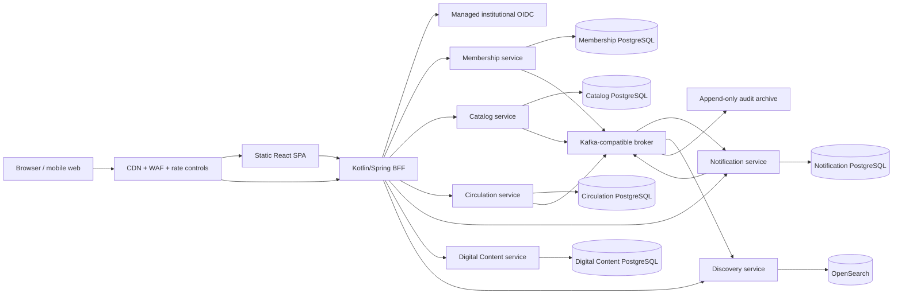

# Production overhaul

Status: **approved architecture; migration in progress; production release held**

This document is the execution contract for turning Mundiapolis Library into a
high-availability product. It deliberately does not use “perfect” or “secure”
as unverifiable acceptance criteria. A release is acceptable only when the
measurable security, correctness, performance, recovery, and operational gates
below pass.

## Executive decision

Keep Next.js only as a temporary migration shell. The final web tier is a
static React/Vite application behind a Kotlin/Spring BFF. Move business
capabilities into a small set of Kotlin/Spring services. PostgreSQL remains the
authoritative database. This is not a rewrite into dozens of services and it
is not a big-bang cutover.

The target platform is:

| Concern         | Decision                                                                   |
| --------------- | -------------------------------------------------------------------------- |
| Web/BFF         | Static React/Vite SPA plus Kotlin/Spring BFF; Next.js is migration-only    |
| Services        | Kotlin 2.3, Spring Boot 4.1, JDK 25, Spring MVC with virtual threads       |
| Persistence     | PostgreSQL 18, one owned database/schema and credentials per service       |
| SQL/migrations  | jOOQ-generated types and Flyway forward migrations                         |
| Identity        | Managed institutional OIDC with authorization-code flow and PKCE           |
| Events          | Kafka-compatible managed broker, Protobuf contracts, transactional outbox  |
| Ephemeral state | Redis for bounded cache, rate limits, locks, and idempotency acceleration  |
| Search          | OpenSearch read model fed by versioned domain events                       |
| Runtime         | Managed Kubernetes, managed stateful services, Terraform, Helm, GitOps     |
| Telemetry       | OpenTelemetry, Prometheus, Grafana, centralized structured logs and traces |
| Delivery        | Reproducible OCI images, SBOMs, signed provenance, progressive deployment  |

The detailed decisions are in
[ADR 0001](./adr/0001-backend-platform-stack.md) and
[ADR 0002](./adr/0002-service-boundaries-and-data-ownership.md), with the
final web tier superseded by
[ADR 0003](./adr/0003-static-spa-and-kotlin-bff.md).

## Implemented checkpoint

As of 2026-08-03, Phase 0 containment and the first circulation vertical slice
are implemented in the repository:

- The legacy application uses transaction-capable PostgreSQL everywhere,
  canonical forward migrations, database constraints, atomic circulation and
  privilege transitions, fail-closed production configuration, centralized
  request admission for every API and mutating page request, stricter
  credential budgets, same-origin mutation checks, bounded server-mediated
  uploads, safe response projections, append-only audit storage, and expanded
  CI security gates. Redis and PostgreSQL admission backends share
  privacy-preserving keys; the PostgreSQL path is concurrency-verified and caps
  rejected traffic at one sentinel count above the configured budget.
- A fresh PostgreSQL 18 database is migrated, inspected, seeded, and exercised
  by synchronized approval/return races in CI.
- The BFF contains a fail-closed generic OIDC client foundation with
  authorization code, PKCE, state, nonce, exact issuer/subject provisioning,
  verified-domain defenses, and no provider-token persistence. Staging and
  production reject legacy credentials. Real tenant integration, privileged
  MFA, recovery, logout, and adversarial provider tests remain release gates.
- `services/circulation-service` implements request, deterministic copy
  allocation/approval, rejection, member cancellation, return, renewal,
  fair edition reservation queues, automatic hold expiry, copy registration/
  condition/relocation, and immutable-ledger fine commands
  as caller-bound idempotent commands.
  State, exact replay results, append-only inventory/fine audit entries, and
  versioned outbox events commit atomically.
- The service publishes a machine-validated OpenAPI 3.1 contract whose route,
  scope, idempotency, and transport field sets are checked against the Kotlin
  controllers in tests. Copy inventory events extend the additive Protobuf v1
  envelope; every copy availability mutation now emits its authoritative,
  contiguous copy version, including hold, checkout, return, and release
  transitions. Terminal fine payments encode the domain `SETTLED` state.
- The service validates issuer, audience, and scopes, binds self-service
  requests to a UUID membership claim, isolates idempotency by authenticated
  actor/client, and has real PostgreSQL 18 tests for 100-way command races and
  cross-principal replay isolation.
- The circulation outbox now has crash-recoverable leasing, bounded retries,
  poison-event blocking, Protobuf v1 encoding, synchronous Kafka acknowledgement,
  lag/blocked health and metrics, retention cleanup, and a lease-expiry recovery
  integration test. Its domain and notification streams share the delivery
  machinery but retain independent aggregate ordering, topics, schemas, and
  uniqueness. Hold-ready notification intents commit atomically with both
  immediately-ready and queue-promoted reservations. Delivery remains correctly
  classified as at least once.
- Circulation now consumes Membership's minimal versioned eligibility event
  into a local projection with an atomic immutable inbox, strict transport and
  Protobuf validation, per-member ordering, manual offsets after database
  commit, duplicate replay, gap/conflict detection, readiness failure, and
  transport-level tests. Request, approval, and renewal fail closed while
  returns remain available to suspended members.
- Circulation policy is now an immutable, actor-audited revision history with
  compare-and-set administration, exact idempotent replay, ETags, and outbox
  events. Loan, renewal, fine, reservation, and expiry decisions read the
  current persisted policy inside their command transaction.
- The service enforces distributed authenticated-principal rate limits before
  controllers run, with separate read, command, and sensitive-operation
  budgets, atomic capped PostgreSQL counters, bounded cleanup, observable
  outcomes, standard 429 metadata, and fail-closed admission when its store is
  unavailable. Public-edge DDoS/WAF controls remain a platform gate.
- The service exposes revisioned policy and privacy-preserving eligibility
  reads with separate self-service and staff scopes. Routes and admission
  outcomes are enforced by the machine-checked OpenAPI contract.
- The Kotlin BFF now exposes caller-bound eligibility plus idempotent loan and
  reservation self-service routes through RFC 8693 token exchange. Fixed
  Circulation `/me` endpoints remove member identifiers from browser input,
  while canonical claim binding, CSRF, bounded clients, response validation,
  and delegated token eviction preserve the service boundary.
- GitOps now isolates runtime, platform, and migration layers. Schema-owner
  credentials and Jobs live in protected `*-migrations` namespaces; the
  workload Argo project cannot manage Jobs, RBAC, secret stores, or those
  namespaces. Admission policy fixes approved secret names, remote keys, stores,
  and target Secret names.

This checkpoint is not general availability. Reservation and dynamic-policy
capabilities are implemented and their invariant/replay suites pass, but the
Phase 2 backfill/reconciliation exit evidence is not yet signed off. The
platform/IdP, remaining domain extractions, data
backfill/cutover, production load and failure tests, independent penetration
test, restore/DR exercise, and operational sign-off remain mandatory.

## Target architecture

```mermaid
flowchart LR
    Browser["Browser / mobile web"] --> Edge["CDN + WAF + rate controls"]
    Edge --> SPA["Static React SPA"]
    Edge --> BFF["Kotlin/Spring BFF"]
    SPA --> BFF
    BFF --> IdP["Managed institutional OIDC"]
    BFF --> Membership["Membership service"]
    BFF --> Catalog["Catalog service"]
    BFF --> Circulation["Circulation service"]
    BFF --> Notifications["Notification service"]
    BFF --> DigitalContent["Digital Content service"]
    BFF --> Discovery["Discovery service"]

    Membership --> MembershipDb[("Membership PostgreSQL")]
    Catalog --> CatalogDb[("Catalog PostgreSQL")]
    Circulation --> CirculationDb[("Circulation PostgreSQL")]
    Notifications --> NotificationDb[("Notification PostgreSQL")]
    DigitalContent --> DigitalContentDb[("Digital Content PostgreSQL")]
    Discovery --> Search[("OpenSearch")]

    Membership --> Broker["Kafka-compatible broker"]
    Catalog --> Broker
    Circulation --> Broker
    Notifications --> Broker
    Broker --> Notifications
    Broker --> Discovery
    Broker --> Audit["Append-only audit archive"]
```

Every service owns its writes. No service queries another service's database.
Circulation owns physical copies, requests, reservations, loans, renewals,
circulation policy, and the fine ledger together because those records share
one consistency boundary.

Events are delivered at least once. Producers write business state and an
outbox record in one PostgreSQL transaction. Consumers keep an inbox/deduplication
record and make every effect idempotent. “Exactly once” is not claimed.

## Security model

The verification baseline is OWASP ASVS 5.0 Level 2 for the whole product, plus
the applicable Level 3 controls for administrators, identity evidence, fines,
personal information, audit data, and infrastructure control planes.

Required controls include:

- Managed OIDC, phishing-resistant MFA for privileged users, short sessions,
  rotation, revocation, step-up authentication, and recovery controls.
- Authorization at the BFF and again at each service using exact issuer,
  audience, expiry, scope, and role checks. Administrative privileges are
  granular capabilities rather than one all-powerful boolean.
- HttpOnly, Secure, SameSite cookies at the browser boundary. OAuth access and
  refresh tokens are never exposed to browser JavaScript.
- Same-origin protection on cookie-authenticated mutations, strict CORS, a
  deployable Content Security Policy, HSTS, MIME-sniffing protection, safe
  framing policy, and restrictive permissions policy.
- Private object storage for identity documents with malware scanning,
  decoding/re-encoding, short-lived signed reads, retention rules, and audited
  access. Identity evidence is never placed in JWTs.
- Envelope encryption using managed KMS, secrets in a managed secret store,
  automated rotation, and no long-lived cloud credentials in CI.
- Append-only privileged audit events written with the mutation, exported to
  immutable retention storage, monitored for gaps, and protected from operators
  who administer the application.
- Per-account and per-network abuse controls, bounded inputs, query budgets,
  pagination, upload limits, resource quotas, and safe degradation when a
  security dependency fails.
- Dependency pinning, automated updates, SAST, secret scanning, IaC scanning,
  container scanning, SBOMs, image signing, admission policy, and independent
  penetration testing.

No release may have an accepted or unaccepted known critical/high vulnerability.
Medium findings require an owner, due date, compensating control, and written
risk acceptance.

## Reliability and scale objectives

The initial objectives are deliberately measurable and are revisited when real
traffic data is available:

| Objective                      | Initial target                                    |
| ------------------------------ | ------------------------------------------------- |
| Monthly availability           | 99.95% for authenticated product flows            |
| Catalog/discovery read latency | p95 below 250 ms, p99 below 750 ms                |
| Circulation command latency    | p95 below 500 ms, p99 below 1 s                   |
| Error budget                   | 21.9 minutes/month at 99.95%                      |
| Data loss                      | RPO no greater than 5 minutes                     |
| Service recovery               | RTO no greater than 30 minutes                    |
| Sustained load                 | 2× measured/forecast peak for 30 minutes          |
| Burst load                     | 5× measured/forecast peak for 5 minutes           |
| Correctness                    | zero violated circulation or financial invariants |

Capacity is budgeted end to end: ingress, pod concurrency, thread/connection
pools, PostgreSQL sessions, broker partitions, consumers, Redis, object storage,
and third-party provider limits. Autoscaling is based on latency, saturation,
queue lag, and database capacity—not CPU alone.

## Migration sequence and gates

### Phase 0 — Contain the legacy risk

Purpose: make continued operation and migration safer without pretending the
legacy architecture is the destination.

Deliverables:

- Use a transaction-capable PostgreSQL driver in every environment.
- Repair the clean migration chain and assert the production schema in CI.
- Add database constraints for duplicate active requests and invalid lifecycle
  state.
- Make approval, return, renewal, rejection, inventory, and privilege changes
  conditional and atomic.
- Remove secrets and sensitive documents from browser payloads.
- Disable unrestricted upload signing and production fixture accounts.
- Validate every server action input and eliminate mass assignment.
- Add dependency, schema, type, lint, test, build, and container gates.

Exit gate: clean-install and representative upgrade migrations pass; all legacy
P0 findings are closed; reconciliation reports show no invalid records.

### Phase 1 — Platform and identity

- Provision separate non-production and production accounts/projects.
- Create managed Kubernetes, managed PostgreSQL, broker, Redis, object storage,
  KMS, secret store, DNS, WAF, and private networking through Terraform.
- Establish GitOps, workload identity, signed images, policy enforcement,
  telemetry, alerting, and cost controls.
- Integrate managed OIDC in the BFF and services; require privileged MFA and
  remove credentials/password ownership from the application.

Exit gate: threat model reviewed, access review complete, break-glass tested,
and an isolated environment can be rebuilt from source.

### Phase 2 — Circulation vertical slice

- Build copy-level inventory, request, loan, renewal, policy, fine ledger,
  idempotency, outbox, audit, and reconciliation capabilities.
- Publish OpenAPI and versioned event contracts.
- Test all state transitions against real PostgreSQL with concurrency and
  process-failure injection.
- Backfill copies and legacy loans into an isolated target database.

Exit gate: the invariant and replay suite passes, outbox recovery is proven, and
backfill reconciliation is exact.

The caller-bound circulation API now includes deterministic, status-filtered
keyset pages for member loan and reservation history. Both the service and
Kotlin BFF derive membership from the delegated token, cap pages at 100 items,
reject non-canonical cursors, and emit non-cacheable browser responses.

### Phase 3 — Shadow and circulation cutover

- Mirror sanitized commands to a non-authoritative shadow evaluator.
- Compare decisions and projections continuously without changing target state.
- Freeze conflicting schema changes and complete a final backfill.
- Switch the BFF to exactly one circulation writer behind a kill switch.
- Soak, reconcile, and retain a tested rollback path.

Exit gate: no unexplained parity differences, the soak window passes SLOs, and
operators demonstrate rollback. Dual-writing inventory is forbidden.

### Phase 4 — Membership and catalog

- Move member eligibility/profile ownership to Membership.
- Move works, editions, contributors, media, and reviews to Catalog.
- Replace BFF database imports with service contracts.
- Migrate identity documents to private object storage and apply retention.

Implementation checkpoint (2026-09-28): Membership has a PostgreSQL-backed read
slice for authoritative profiles, fail-closed eligibility, and privacy-safe
identity-evidence metadata. Membership now owns version-checked, actor-bound,
idempotent account-status changes; state, privacy-minimized audit evidence, and
minimal eligibility outbox events commit atomically. Self-status changes and
suspension of the final approved administrator are rejected. Membership owns
the privacy-minimal Protobuf v1 eligibility contract and strictly encodes
outbox payloads against it; Circulation verifies its consumer copy byte for
byte during every build. Membership delivery now uses crash-recoverable,
member-ordered leases, synchronous idempotent Kafka acknowledgements, bounded
retries, poison-event blocking, retention cleanup, and lag/blocked readiness
and metrics. The Kotlin BFF now routes the authenticated self-profile read
through RFC 8693 token exchange, a fixed `/me` service route, strict
audience/scope/claim binding, bounded network clients, and fail-closed response
validation. Broker provisioning, remaining profile and eligibility writes,
backfill, other BFF routes, and production cutover remain pending.
Catalog now has a separate PostgreSQL-backed read
slice for works, editions, contributors, media references, privacy-safe
published reviews, and SQL search/pagination. Review reads exclude member
identifiers and hidden moderation content. Exact OIDC issuer/audience/type and
scope enforcement,
Flyway/jOOQ schema generation, versioned OpenAPI contracts, and real PostgreSQL
integration coverage protect both boundaries. Physical copies remain owned by
Circulation; Catalog stores only a disposable, versioned availability
projection. Catalog now consumes authoritative per-copy Circulation events
through strict Protobuf/header validation, an atomic inbox, contiguous aggregate
versions, manual offsets, derived edition counts, and readiness failure on
poisoned or gapped input. The same consumer now retains an ordered minimal loan
projection so review eligibility can be proven from returned-loan evidence
without reading Circulation's database. Catalog now owns idempotent member review
create/update/delete commands: identity is JWT-bound, create eligibility comes
from that returned-loan projection, aggregate ratings update transactionally,
and privacy-minimized audit/outbox events retain neither member IDs nor review
text. Membership backfill/reconciliation, retention/deletion automation, BFF
routing, and production cutover are not complete, so the Phase 4 exit gate
remains open.
Catalog create, metadata-update, and edition-activation commands
now share an actor-bound idempotency foundation: aggregate state, exact replay
response, append-only audit, and a versioned outbox event commit in one
transaction. Updates require exact version ETags and reject stale writers.
Catalog outbox delivery now uses crash-recoverable aggregate-ordered leases,
bounded retries, poison-event blocking, Protobuf v1 encoding, synchronous Kafka
acknowledgements, retention cleanup, and health/metrics. Broker provisioning,
availability replay/reconciliation evidence and production cutover gates remain
open. The Kotlin BFF and SPA now route the administration slice through a
separate `catalog.manage` token after a fresh Membership admin check; this is
implemented but not yet the public production authority.

Exit gate: there are no cross-service database reads or writes and all privacy
retention/deletion workflows pass.

### Phase 5 — Notifications and discovery

- Send notification intents through the circulation/catalog outboxes.
- Add provider-specific workers with retry, deduplication, DLQ, suppression,
  preference, and delivery observability.
- Build OpenSearch projections for catalog, availability, and recommendations.
- Make every read model disposable and rebuildable from events/snapshots.
- After notification operational controls and the core search projection are
  complete, add a rights-aware engineering collection ingestion slice. Seed
  curated, institutionally credible open textbooks from OpenStax, the Open
  Textbook Library, OAPEN/DOAB, and Project Gutenberg before importing the
  broader Open Library metadata dumps or using Google Books enrichment.
- Serve authorized open-access and public-domain files through the Mundia web
  download endpoint backed by private S3 and CloudFront, so the product exposes
  one first-party Download action. Persist source, immutable object digest,
  license, territorial constraints, attribution, and last rights verification;
  malware-scan and quarantine every imported object; use short-lived signed
  delivery; and never ingest or proxy a work without redistribution rights.
  Copyrighted titles remain discoverable as preview, external-loan, purchase,
  or metadata-only records rather than being misrepresented as downloads.

Implementation checkpoint (2026-10-03): the Kotlin Notification service now
owns its PostgreSQL/Flyway schema for member preferences, in-app inbox items,
and channel-delivery state. Its first caller-bound API provides bounded,
deterministic keyset pages, read-state filtering, and idempotent mark-read
behavior using only the canonical delegated `membership_id` claim. Exact JWT
issuer, audience, type, and scope checks, machine-checked OpenAPI, real
PostgreSQL integration tests, a hardened OCI image, container scanning, and
GHCR publication are wired into CI. A strict Protobuf Kafka consumer now uses
bounded `read_committed` fetches, manual post-transaction acknowledgement,
TLS/SASL-safe configuration, fail-closed readiness, and atomic creation of the
inbox item, channel deliveries, and a payload-digest receipt. Exact and
concurrent replays are idempotent while conflicting bytes poison-stop the
consumer without committing the offset. Circulation now emits hold-ready intents
from its transactional outbox for both immediate and queued reservation readiness,
routes them to the dedicated notification topic, and verifies its producer copy
of the Protobuf contract byte-for-byte against the consumer. Containerized Kafka
integration tests prove that Circulation's production idempotent/zstd producer
delivers the contract with its required routing metadata and that Notification's
configured consumer durably creates the inbox/delivery state before committing
the offset. Caller-bound preference reads and strongly versioned updates now
enforce mandatory in-app delivery, converge exact concurrent retries, reject
stale conflicting writes, and record disabled email/category deliveries as
`SUPPRESSED`. The provider-neutral email worker core now uses PostgreSQL
`SKIP LOCKED` leases, lease-fenced acknowledgements, stable correlation IDs,
bounded call timeouts, exponential retry with deterministic jitter, terminal
dead-letter state, and backlog/lease metrics. Its bounded OAuth client-credentials
resolver now requests only `membership.profile.read.any`, validates the exact
Membership audience and returned member identity, caches short-lived tokens,
and never places email addresses on Kafka. The AWS SES v2 sender now uses
bounded SDK timeouts, no hidden SDK retries, fail-closed sender/configuration-set
validation, explicit retry/permanent error classification, and the default AWS
credential chain for EKS workload identity. Every request carries its durable
delivery UUID as a custom header and SES tag. Because SES `SendEmail` has no
idempotency token, ambiguous outcomes retain at-least-once semantics rather than
claiming exactly-once provider delivery. Signed SES event ingestion now consumes
non-raw SNS envelopes from an encrypted SQS queue, requires SHA-256 signatures
from the exact regional SNS certificate host and topic ARN, and bounds message,
age, network, and certificate resources. Transactional receipts deduplicate
standard-queue replay while monotonic provider outcomes prevent late events from
regressing complaints or bounces. No recipient address or raw feedback payload
is persisted. Signed complaints and permanent bounces now atomically create
privacy-preserving member suppressions, cancel queued work, fence claimed work
before recipient resolution, and suppress future email intents while mandatory
in-app delivery continues. Transient and undetermined bounces remain observable
without suppressing delivery. Controlled removal now requires a dedicated
least-privilege scope, a canonical idempotency key and meaningful operator
justification; it serializes against intent/feedback races, snapshots the prior
state into a durable audit row, and restores only future eligible email work.
Dead-letter replay is now delivery-specific and least-privilege, records the
prior terminal failure and operator justification, converges concurrent exact
requests, rejects suppressed recipients, and starts only one fresh bounded
attempt cycle. Circulation now schedules due-soon and overdue intents in bounded
`SKIP LOCKED` batches, revalidates active loans under a row lock, and atomically
persists each intent with a receipt keyed by loan, observed due date, and reminder type. This
makes concurrent replicas converge while renewed due dates remain eligible for
a fresh reminder. Legitimate catalog-triggered intents and Kubernetes/Terraform
values remain required before production routing. Caller-bound inbox, mark-read,
and strongly versioned preference routes now pass through the Kotlin BFF using
RFC 8693 token exchange, strict downstream response validation, CSRF protection,
bounded request/response bodies, no-store responses, and delegated-token
eviction. The Digital Content service has started as a separate Kotlin ownership
boundary with its own PostgreSQL/Flyway schema and machine-readable contract.
Its first read slice returns only globally authorized, unexpired, malware-clean,
published PDF/EPUB availability and never exposes private object keys or
provenance URLs. Download authorization now locks and rechecks those gates,
records a privacy-minimized audit, and produces an RSA/SHA-256 CloudFront URL
bounded to five minutes and one exact object. The Kotlin BFF routes both calls
through token exchange and rejects unexpected origins, paths, signing parameters,
asset identities, or expiries. A caller-bound ingestion command now persists a
rights-reviewed manifest and issues only short-lived, create-only S3 quarantine
grants bound to exact size, media type, SHA-256 checksum, expected account, and
KMS key. A production-shaped SQS consumer strictly validates GuardDuty
EventBridge results, commits idempotency receipts and immutable object-version
evidence atomically, acknowledges only after commit, and treats every result
except `NO_THREATS_FOUND` as rejection. Safe object promotion, lifecycle/IaC,
the hosted-asset SPA download path, and the core OpenSearch projection remain
pending; verified external-resource downloads already use the BFF authorization
path without proxying third-party bytes.

While the full Kotlin Digital Content boundary is being completed, the Vercel
application provides a deliberately narrow learning-resource catalog. It stores
metadata only, imports at most 250 records per idempotent batch from an exact
EbookFoundation Git revision, and publishes only records with evidence for
CC BY, CC BY-SA, CC0, or public-domain rights. Everything else is quarantined
for an append-only, audited admin decision. Public queries are backed by
PostgreSQL full-text/category indexes, and downloads are authenticated redirects
to the verified official HTTPS source; the application does not host files. A
strict exception streams allowlisted, public-domain NIST PDFs smaller than 4 MB
as attachments, with an upstream timeout, exact-host check, declared and actual
body-size limits, content-type enforcement, and no-store/nosniff headers. A
second adapter consumes bounded DOAB OAI-PMH pages, validates
XML with entity processing disabled, filters for engineering disciplines, and
uses the per-file licence URI as evidence. The Open Textbook Library adapter
adds CC BY, CC BY-SA, and CC0 university textbooks from fixed computer science,
engineering, mathematics, physics, management, statistics, database,
information-systems, programming-language, and engineering-discipline subject
endpoints. A complete-subject runner fetches bounded pages, fingerprints the
whole snapshot, deduplicates official record identifiers, and commits one
revision-pinned batch. Subject metadata and conservative title rules provide
useful Aerospace, Industrial, Civil, Mechanical, Electrical, Cloud, Security,
and related catalog filters. Direct PDF/EPUB URLs are
labelled as downloads; repository and publisher landing pages are explicitly
labelled as third-party sources. A bounded Wikibooks adapter imports fixed UNIX,
Linux, software-engineering, security, system-administration, and version-control
shelves only when the API returns the expected CC BY-SA 4.0 rights declaration
and the book root has no fair-use or copyright-review flag. Its official
Wikimedia PDF endpoint sends files as attachments, so downloads remain direct
without consuming Vercel transfer. A Project Gutenberg adapter consumes bounded
official OPDS bookshelf pages and verifies every title against its per-book OPDS
rights statement. Public-domain records link to the canonical ebook landing page
instead of hotlinking files, as required by Gutenberg's linking policy, while
copyrighted permission titles stay quarantined. A reviewed NIST SP 800 manifest
adds cloud-native/API security, DevSecOps, zero trust, container security,
identity, incident response, VPN, firewall, monitoring, and supply-chain
guidance. Every entry resolves its PDF from the official CSRC page and passes
official-host, PDF range, and free-tier proxy-size checks; failures remain
quarantined. NIST's technical-series policy supplies a worldwide royalty-free
reprint grant in addition to the U.S. public-domain status. A reviewed FAA
manifest adds official aerodynamics,
aircraft-maintenance, avionics, UAS, aircraft-systems, and flight-engineering
handbooks. Each FAA PDF is range/type/size checked and linked directly from its
public-domain official source without passing the large file through Vercel.
The public catalog now carries bounded descriptions plus optional cover metadata.
Only exact, verified Project Gutenberg cover URLs are rendered; all other records
use a restrained typographic bookplate, so the interface never invents or copies
unlicensed artwork. The cover allowlist rejects alternate hosts, credentials,
ports, query strings, fragments, and mismatched book identifiers. An OWASP
adapter verifies the live official index and the project-level CC BY-SA 4.0
statement before exposing its complete Cheat Sheet Series as read-at-source
material. A smaller curated Kubernetes learning path verifies each live official
documentation page and the website repository's CC BY 4.0 licence before import.
Both adapters fail closed, store metadata only, and are revision-pinned and
idempotent.
The DOAB adapter also extracts bounded abstracts and official catalog thumbnail
bitstreams for verified records only. Its cover policy requires an exact DOAB
host and bitstream path, an allowlisted image media type, and a two-megabyte
metadata size ceiling. A bounded collection runner can review up to ten OAI
pages while refusing any batch above 250 engineering records. Rocky Linux's two
official administration course books add more than 470 pages of directly linked
Linux, UNIX, networking, web-service, shell, security, and operations material;
both the live PDFs and repository-level CC BY-SA 4.0 licence are checked before
import. Open Library is intentionally not a public-content source: its cover API
permits public display, but its licensing notice warns that contributed records
can have unresolved existing rights, and its availability flags are not
per-edition licence evidence. A bounded arXiv OAI-PMH adapter adds current
security, software, distributed-systems, networking, operating-systems,
architecture, robotics, and performance research. It reads the official
per-paper licence URI, publishes only CC BY, CC BY-SA, or CC0 papers, and
quarantines arXiv's default distribution licence and all non-commercial or
no-derivatives variants. Imports are limited to 250 records, revision-pinned,
metadata-only, and link directly to official arXiv abstract and PDF URLs. The
Internet Archive adapter deliberately excludes community uploads because their
licence metadata is user-controlled. It searches only the tightly identified
NASA Technical Reports collection, re-fetches every item's metadata, requires
the exact item-level public-domain declaration and an original PDF, limits
concurrency to four with pauses between groups, and imports at most 50 records
per revision-pinned run. Verified NASA items also display the official
Internet Archive item thumbnail directly; the exact NASA identifier path is
allowlisted and no image is copied or proxied. Kotlin Digital Content now owns the first external-file
rights slice: machine-scoped registration is immutable, actor-bound, and
manifest-idempotent; only canonical allowlisted licences and strict public HTTPS
URLs are accepted. Availability hides the download target, authorization
rechecks current global rights and commits a privacy-minimized audit, and the
Kotlin BFF validates the returned public URL behind session and CSRF controls.
No service proxies the third-party bytes. OpenStax was
re-evaluated in October 2026, but its current catalog-wide CC BY-NC-SA terms are
outside this project's CC BY/CC BY-SA/CC0/public-domain allowlist. It remains
excluded unless a durable qualifying per-edition licence can be proven. Catalog
metadata ownership has now moved into the Kotlin Catalog boundary. Catalog V8
adds indexed learning-resource metadata plus immutable import receipts; V9
adds licence links and explicit download/read-at-source display modes while
leaving every download decision in Digital Content. Bounded
machine-scoped commands are actor- and manifest-bound, and dedicated read APIs
provide stable search, detail, and category results without exposing download
targets. The verified-only legacy backfill command creates deterministic batches
of at most 250 records and performs read-after-write receipt reconciliation.
Running that backfill against production, archiving its evidence, and enabling
the already-implemented Kotlin BFF/SPA read and administration slices remain
pending before the temporary Next.js slice can retire. The static Vite shell now consumes generated BFF types,
boots the server-held session, renders responsive learning-resource search and
detail states, and obtains CSRF-protected download authorizations. Its cutover
flag is disabled by default until backfill reconciliation and edge tests pass.
The hardened Web BFF deployment now renders in every GitOps environment with
TLS-only origin ingress, External Secrets, autoscaling, disruption budgets, and
allowlisted service egress. A provider-neutral same-origin contract defines the
private static origin, uncacheable BFF/auth routes, canonical-host redirect, and
edge-only origin requirement; selecting and applying the CDN/WAF implementation
remains an explicit production decision.

Exit gate: broker/provider/search outages cannot corrupt authoritative state;
replay and full projection rebuilds are demonstrated.

### Phase 6 — Retire the monolith backend

- Remove legacy domain write paths, obsolete tables, direct database access,
  duplicate caches, credentials auth, and migration scripts.
- Complete vertical-slice migration to the static React SPA and Kotlin BFF.
- Remove Next.js only after parity, rollback, and retention gates pass.
- Archive reconciliations and migration evidence.

Exit gate: dependency and data-flow scans find no legacy ownership violations,
and rollback retention has elapsed with product approval.

## Mandatory verification before general availability

1. Fresh and production-shaped upgrade migrations pass with zero unmanaged drift.
2. One hundred concurrent approvals of one request yield exactly one success.
3. Concurrent request/approve/reject/cancel/return/renew/inventory-edit tests
   never violate a copy, loan, or ledger invariant.
4. Every mutating endpoint is idempotent or conditionally replay-safe.
5. A process crash after commit but before publish is recovered from the outbox.
6. Duplicate and out-of-order events create no duplicate external effect.
7. PostgreSQL, broker, Redis, identity, email, object storage, and search failure
   drills demonstrate defined degradation and recovery.
8. Production-shaped data passes the sustained, burst, soak, and cold-cache
   load tests with the SLOs above.
9. Point-in-time restore, zone loss, credential rotation, and regional recovery
   meet RPO/RTO and have signed evidence.
10. ASVS evidence is complete, security automation is green, and an independent
    penetration test has no open critical/high finding.
11. On-call dashboards, actionable alerts, runbooks, ownership, escalation,
    status communication, and post-incident practice are complete.
12. Product, security, data, platform, and operations owners sign the launch
    review. A deadline cannot waive correctness or security gates.

## Rollback rules

- Every schema change is expand/contract and backward compatible until its
  rollback window closes.
- Every service cutover has an explicit BFF kill switch and a documented data
  reconciliation point.
- Rollback never creates two writers. If target writes have begun, rollback uses
  an audited reverse migration or pauses commands while ownership is restored.
- Failed projections are rebuilt; authoritative data is never repaired from a
  cache or search index.
- Release rollback, database restore, credential rotation, broker replay, and
  object-store recovery are rehearsed, not merely documented.

## Definition of done

The overhaul is complete only when all phases have passed their exit gates,
legacy backend ownership has been retired, production telemetry demonstrates
the SLOs through the agreed soak period, independent security testing is clean,
and disaster recovery has been exercised with evidence. Code completion alone
is not production readiness.
