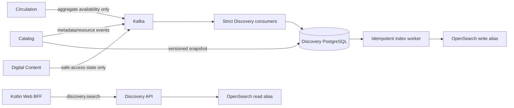

# Search and Discovery service implementation handoff

Status: **accepted boundary; implementation delegated; no service code or
deployment exists**

This is the authoritative build contract for the future Kotlin Search and
Discovery service. It reserves architectural space without claiming that the
service, OpenSearch domain, or AWS deployment exists or is funded.

## Required outcome

Build `services/discovery-service`, a stateless Kotlin/Spring API with durable
projection workers. It turns privacy-minimal domain events into a disposable
OpenSearch read model and serves fast, bounded, non-personalized search across
physical editions and verified open-learning resources.

The service must be fully rebuildable from authoritative snapshots and retained
events. Losing OpenSearch must never lose business data. Catalog's current
PostgreSQL search remains the rollback authority until shadow comparison,
relevance, security, performance, recovery, and cutover gates pass.

## Ownership and non-goals

| Capability | Authority | Discovery responsibility |
| --- | --- | --- |
| Works, editions, contributors, reviews, learning resources | Catalog | Search projection only |
| Copies, loans, reservations, physical availability | Circulation | Aggregate availability projection only |
| Rights, quarantine, malware, delivery authorization | Digital Content | Coarse safe-access projection only |
| Search mappings, ranking, facets, suggestions, reindexing | Discovery | Sole owner after cutover |
| Browser session and token exchange | Web BFF | Accept audience/scoped service tokens only |

Discovery must not:

- write another service's database or call it with a database credential;
- authorize borrowing, reservation, review, or download commands;
- accept arbitrary OpenSearch JSON, scripts, index names, fields, sorts,
  aggregations, regexes, or analyzers from clients;
- store member IDs, raw circulation history, identity evidence, email, private
  object keys, signed URLs, credentials, or person-linked search history;
- make OpenSearch the only copy of any domain fact;
- introduce a separate recommendation service. Recommendations remain a later,
  separately approved capability inside this boundary.

## Repository and technology contract

Follow existing service conventions:

```text
services/discovery-service/
├── build.gradle.kts
├── gradle.lockfile
├── Dockerfile
└── src/
    ├── main/kotlin/com/mundiapolis/library/discovery/
    │   ├── adapter/in/events/
    │   ├── adapter/outbound/opensearch/
    │   ├── adapter/outbound/persistence/
    │   ├── application/
    │   ├── config/
    │   └── web/
    ├── main/proto/mundia/...       # reviewed copies of consumed contracts
    ├── main/resources/db/migration/
    ├── main/resources/static/openapi/discovery-v1.json
    └── test/kotlin/...
```

Use Kotlin 2.3, Spring Boot 4.1, JDK 25, Spring MVC with virtual threads,
Flyway, jOOQ, Micrometer/OpenTelemetry, PostgreSQL, Kafka, and the official
OpenSearch Java client. Reuse the repository's locked Gradle/plugin versions.
Do not introduce Node.js or TypeScript into this service.

Add the module to `services/settings.gradle.kts`, dependency locking,
`make services-ci`, Docker builds, GHCR publication, repository/container
scans, SBOM/provenance, and documentation indexes. The existing
`lib/services/contracts/discovery.ts` is a migration-era sketch, not the final
contract. Replace its consumers with OpenAPI-generated types and remove it
after the legacy path retires.

## Runtime design



PostgreSQL is the durable inbox, normalized projection, dirty-job, and rebuild
control boundary. OpenSearch is disposable. A Kafka offset is acknowledged only
after inbox receipt plus normalized projection change commit atomically in
PostgreSQL. A separate idempotent worker applies dirty documents to OpenSearch.
Never attempt a distributed Kafka/PostgreSQL/OpenSearch transaction.

## Event and snapshot prerequisites

### Existing input

Catalog already publishes `mundia.catalog.v1.CatalogEvent` on
`mundia.catalog.events.v1` for works, editions, and privacy-minimal review
lifecycle. Use a strict decoder and preserve its aggregate versions. Reject
unknown topic/header/schema combinations, invalid payloads, oversized records,
future-skewed timestamps, gaps, and conflicting replays.

### Required producer work

Do not bypass missing contracts with database reads or broad topic access:

1. Catalog must add an additive learning-resource lifecycle payload containing
   only the complete public searchable record and active state. It must exclude
   private provenance and download grants.
2. Circulation or Catalog must publish a dedicated availability aggregate:
   edition ID, total/available counts, boolean availability, projection version,
   and observation time. Discovery must not read the current mixed Circulation
   topic because it contains member-linked loan/reservation events.
3. Digital Content must publish edition/resource ID, `NONE`/`EXTERNAL`/`HOSTED`
   access mode, public licence expression, safe publication state, rights check
   time, and version. Exclude object keys, signed URLs, scanner payloads, and
   quarantined records.
4. Catalog, availability, and Digital Content owners must provide bounded,
   keyset snapshot exports with snapshot ID, per-item digests, manifest digest,
   and event high-water marks. Rebuilds may not scan their databases or guess
   Kafka offsets.

Reserved names:

| Projection | Topic | Consumer group |
| --- | --- | --- |
| Catalog metadata | `mundia.catalog.events.v1` | `mundia-discovery-catalog-v1` |
| Availability | `mundia.discovery.availability.v1` | `mundia-discovery-availability-v1` |
| Digital access | `mundia.digital-content.discovery.v1` | `mundia-discovery-digital-v1` |

Require authenticated TLS, separate least-privilege principals, `read_committed`,
manual commits, bounded fetch/poll sizes, retained uncompacted ordered history,
lag alerts, and documented reset authority. Runtime credentials are never the
operations-admin credential.

## Durable projection model

At minimum, own these PostgreSQL records:

| Record | Invariant |
| --- | --- |
| `discovery_event_inbox` | Unique event ID and topic/partition/offset; payload digest detects conflicting replay |
| `discovery_aggregate_version` | Last contiguous source version; gaps poison-stop that consumer |
| work/edition/resource projections | Normalized public fields and source version |
| availability projection | Counts only; never member/copy/loan identifiers |
| access projection | Coarse safe-access state and verification time |
| `discovery_index_job` | Coalesced dirty document with fenced lease, attempts, retry time, terminal state |
| `discovery_reindex_generation` | Snapshot IDs, offsets, target index, counts, checksums, state, operator evidence |

Constraints must enforce non-negative counts, `available <= total`, known enums,
monotonic versions, bounded strings, and valid timestamps. Migrations are
forward-only and use the isolated migration credential/job pattern.

Work changes mark its active editions dirty in bounded pages. Edition,
availability, or access changes coalesce one dirty job. Workers use `FOR UPDATE
SKIP LOCKED`, lease fencing, bounded exponential retry with jitter, terminal
blocked state, and backlog-age health/metrics.

## OpenSearch contract

Use one deterministic document per result:

- `edition:<edition-uuid>`;
- `resource:<resource-uuid>`.

Documents may contain stable source IDs/type, title/sort title, public author
names, summary, subject/category, ISBN/publisher/year/language, approved cover
metadata, aggregate rating, aggregate availability, public licence/source,
coarse access mode, source versions, local projection revision, observation
time, and indexed time.

Use explicit mappings and disable dynamic fields. Bound keywords. Use tested
language analyzers with a standard fallback. Prohibit scripting, runtime
fields, leading wildcards, arbitrary regex, client-selected analyzers, and
fielddata on text.

Use versioned indexes and aliases:

```text
mundia-discovery-v000001
mundia-discovery-read
mundia-discovery-write
```

The API reads only the read alias. The indexer writes only the write alias.
Runtime identities cannot create/delete indexes or change aliases; a separate
short-lived reindex identity does that. Use monotonic projection revisions so
an older retry cannot overwrite a newer document.

## API contract

Publish and machine-check OpenAPI 3.1 at
`services/discovery-service/src/main/resources/static/openapi/discovery-v1.json`.

### `GET /api/v1/discovery/search`

Require audience `discovery-api` and scope `discovery.search`.

- `query`: normalized Unicode, maximum 200 characters;
- `type`: allowlisted `EDITION`/`LEARNING_RESOURCE`;
- exact bounded filters: category, language, licence, available, downloadable;
- `sort`: `RELEVANCE`, `TITLE`, or `NEWEST`;
- `limit`: 1–50;
- `cursor`: opaque, authenticated, versioned, short-lived `search_after` state;
  never expose raw sort JSON.

Return safe display metadata, stable IDs, allowlisted text highlights, aggregate
availability/access, bounded facets, next cursor, projection observation time,
and correlation ID. Never return raw OpenSearch output, private provenance, or
signed downloads. Use `Cache-Control: private, no-store` until a separate cache
review approves otherwise.

Add `GET /api/v1/discovery/suggestions` only after core search passes. Require a
2–100 character prefix, maximum 10 results, separate rate limit, strict timeout,
and no raw-prefix logging.

Do not expose OpenSearch administration through the browser API. Prefer an
operator/Job. Any HTTP reindex control requires a separate audience and
`discovery.reindex` scope, named operator, approval, reason, idempotency key,
immutable manifest, dry run, and audited status. Search pods never hold reindex
credentials.

## Query and ranking rules

Generate typed OpenSearch DSL server-side. Enforce timeouts, maximum clauses,
bounded `track_total_hits`, aggregation buckets, returned fields, and route
concurrency. Reject unknown parameters.

Initial explainable order:

1. exact ISBN and normalized exact title;
2. title phrase/prefix;
3. contributor and subject;
4. description;
5. small bounded availability/verified-access boosts;
6. deterministic document-ID tie-breaker.

No personalized signals in v1. Version ranking configuration and maintain a
curated multilingual evaluation set covering CS, programming, DevOps,
security, cloud, UNIX, mathematics, electrical, mechanical, industrial, civil,
and aerospace engineering. Ranking changes require offline relevance plus
latency evidence.

## Rebuild and recovery

1. Record a reindex generation with exact image, mapping, analyzer, ranking,
   and source-contract versions.
2. Create a new physical index with the short-lived reindex identity.
3. Obtain stable snapshots and record manifests plus Kafka high-water marks.
4. Validate every digest; upsert normalized projections and bulk-index with
   bounded bytes/concurrency.
5. Catch consumers up from recorded boundaries. Never fabricate events or
   guess offsets.
6. Compare counts, checksums, sampled documents, facets, source versions, and a
   fixed query suite.
7. Require zero lag at the cut and an approved parity report.
8. Atomically swap aliases and keep the previous index for bounded rollback.
9. Observe errors, latency, zero-result rate, and freshness; rollback by alias.
10. Delete old generations only after evidence and rollback retention expire.

Rebuilds are resumable, idempotent, and throttled so they cannot starve live
queries or authoritative APIs.

## Security requirements

- Validate exact issuer, audience, scope, algorithm, time, and token type in
  Discovery. Use a separate BFF token-exchange registration.
- Keep OpenSearch private with verified TLS, at-rest and node encryption,
  index-specific permissions, audit logs, and no public endpoint.
- Separate runtime, consumer, migration, and reindex identities. Grant no
  wildcard cluster administration.
- Normalize Unicode and bound all text/lists/pages/buckets/bodies. Test invalid
  encodings, controls, homoglyphs, query bombs, and malicious highlights.
  Highlights are rendered as text, never trusted HTML.
- Redact query text and result IDs from default logs/traces. Metrics use bounded
  labels and never contain queries, titles, member IDs, or tokens.
- Enforce edge/BFF account/network limits plus service query/concurrency budgets.
  OpenSearch failure must not create a retry storm.
- Extend the threat model for index poisoning, stale rights, expensive queries,
  snapshot tampering, alias takeover, reindex privilege, and behavioral
  inference before production routing.

## SRE objectives

| Signal | Initial gate |
| --- | --- |
| Search availability | 99.95% monthly after cutover |
| Service latency | p95 < 250 ms; p99 < 750 ms |
| Projection freshness | p99 event-to-searchable < 60 seconds under forecast load |
| Capacity | 2× peak for 30 minutes; 5× peak for 5 minutes |
| Rebuild | Exact manifests/counts and zero blocked documents |
| Recovery | PostgreSQL RPO <= 5 minutes; service RTO <= 30 minutes; index rebuild proven |

Instrument API RED, worker/pool USE, Kafka lag/poll age, inbox conflicts/gaps,
dirty-job age/retries/blocked count, bulk latency/failures, OpenSearch rejects,
query timeouts, zero-result rate, index generation/count, and source freshness.
Use low-cardinality labels only.

Readiness requires valid protected configuration, PostgreSQL, a compatible read
alias, and queryable OpenSearch. A broker outage may serve the last good index
during a bounded alerted window while exposing its observation time. Missing,
incompatible, or partially swapped indexes fail closed. Liveness does not
depend on external services.

Autoscale within reviewed OpenSearch/Kafka/PostgreSQL budgets. Bound worker
concurrency and connection pools. Require graceful shutdown, disruption budget,
topology spread, resources, and default-deny NetworkPolicies.

## Tests and CI

Add:

- unit/property tests for normalization, cursor signing, typed DSL, ranking,
  event validation, and projection merging;
- byte-for-byte Protobuf compatibility tests;
- Testcontainers PostgreSQL, Kafka, and pinned OpenSearch integration tests;
- duplicate/conflict/gap/out-of-order/malformed/oversized/poison tests proving
  offsets never advance before durable commit;
- concurrent dirty-job tests proving old writes cannot replace new documents;
- snapshot/rebuild, crash/resume, alias swap/rollback, and parity tests;
- API authorization matrices, cross-audience denial, bounded-input fuzzing,
  injection/query-bomb, headers, and safe-error tests;
- relevance golden tests and production-shaped performance tests;
- the same dependency, secret, IaC, container, SBOM, signature, and provenance
  gates as existing services.

Before merge, `./gradlew clean check bootJar --no-daemon --no-parallel`,
platform validation, repository `make ci`, the new image build, and its zero
HIGH/CRITICAL scan must pass.

## Kubernetes and AWS

Do not run OpenSearch inside Kubernetes. Extend the AWS platform contract with
a private managed domain only after explicit cost approval. Require private
subnets/security groups, encryption, multi-AZ capacity, audit/application/slow
logs, snapshots, maintenance, and deletion protection. This document does not
authorize a paid apply.

Add digest-pinned runtime and migration releases to Helm/GitOps for dev,
staging, and prod. Use External Secrets and EKS Pod Identity. Allow egress only
to owned PostgreSQL, exact Kafka brokers, OpenSearch, OIDC/JWKS, OTLP, and DNS.
Separate runtime/migration namespaces and credentials.

Configuration groups:

- `DISCOVERY_DATABASE_*`
- `DISCOVERY_KAFKA_*`
- `DISCOVERY_OPENSEARCH_*`
- `DISCOVERY_INDEX_*`
- `DISCOVERY_QUERY_*`
- `DISCOVERY_SECURITY_*`
- standard `OTEL_*`

Validate lower/upper bounds for every duration, byte size, batch, concurrency,
retry, result, bucket, and pool value. Protected environments fail fast;
plaintext/test credentials need explicit local-only opt-in.

## Delivery sequence

1. **Contracts/skeleton:** lock the Kotlin module, resource-server security,
   OpenAPI, health/metrics, image, event/snapshot designs, and ACL review.
2. **Durable ingestion:** add Flyway/jOOQ projections and strict Catalog
   consumption; prove replay/gap/crash behavior with real Kafka/PostgreSQL.
3. **Remaining inputs:** add learning-resource, privacy-minimal availability,
   and digital-access feeds only after producer contracts land.
4. **Index/search:** explicit mappings, aliases, idempotent bulk worker, bounded
   API, relevance corpus, performance budgets, dashboards.
5. **Rebuild/staging:** signed snapshot bootstrap, catch-up, parity, alias
   rollback, and Kafka/OpenSearch/PostgreSQL/poison/throttle/full-loss drills.
6. **Shadow/cutover:** separate BFF registration and generated SPA types;
   privacy-safe sampled shadow comparison; canary; rollback; observation window.
7. **Optional later work:** suggestions after search SLOs; recommendations only
   after privacy/design approval, deletion propagation, user controls,
   explainability, and a non-personalized fallback.

## Definition of done

- Contracts are additive, reviewed, and privacy-minimal.
- No cross-service DB or member-bearing event access exists.
- Authoritative snapshots plus retained events rebuild the complete index.
- Inbox/version/gap/conflict and index recovery tests pass.
- OpenAPI, BFF, and SPA generated contracts agree.
- Security, relevance, load, soak, failure, and full-loss recovery gates pass in
  production-shaped staging.
- Dashboards, alerts, runbooks, cost limits, on-call owner, and rollback exist.
- Images are digest-pinned, scanned, signed, and policy-admitted.
- Catalog remains rollback authority until the cutover window closes.
- Production readiness contains reviewed evidence, not claims based only on
  code or Terraform.
