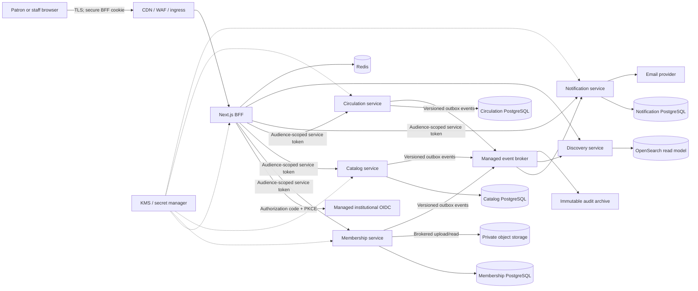

# Mundiapolis Library threat model

| Field                 | Value                                                                                                                                                                               |
| --------------------- | ----------------------------------------------------------------------------------------------------------------------------------------------------------------------------------- |
| Status                | Required security design baseline; implementation and verification remain in progress                                                                                               |
| Model date            | 2026-07-26                                                                                                                                                                          |
| Review cadence        | At least quarterly and before every material identity, data-flow, trust-boundary, or deployment change                                                                              |
| System                | Next.js monolith being migrated by strangler pattern to domain-owned Kotlin/Spring services                                                                                         |
| Assurance target      | OWASP ASVS 5.0.0 Level 2 for the product, with applicable Level 3 controls for privileged access, identity evidence, personal data, fines, audit, and infrastructure control planes |
| Related decisions     | [Production overhaul](./PRODUCTION_OVERHAUL.md), [ADR 0001](./adr/0001-backend-platform-stack.md), [ADR 0002](./adr/0002-service-boundaries-and-data-ownership.md)                  |
| Verification contract | [Security verification](./SECURITY_VERIFICATION.md)                                                                                                                                 |

## Purpose and limits

This model identifies assets, trust boundaries, plausible abuse, required
controls, and known residual risk for the current application and its target
architecture. It is a design and review input, not a claim that the application
is vulnerability-free.

No finite threat model, checklist, scan, penetration test, or architecture can
prove that all vulnerabilities are absent. Release confidence comes from
layered controls, repeatable evidence, independent testing, monitoring, rapid
containment, and continuing review. A control described as **required** is not
implemented merely because it appears in this document.

## Scope

In scope:

- The browser application, Next.js pages, route handlers, server actions, and
  backend-for-frontend (BFF).
- Current credential authentication and the migration to managed institutional
  OpenID Connect (OIDC).
- Membership, catalog, circulation, notifications, discovery, reviews,
  recommendations, fines, exports, and administrative workflows.
- PostgreSQL, Redis, the event broker, search index, object storage, email
  providers, workflow/webhook providers, and the append-only audit archive.
- Service-to-service APIs and events.
- OCI build and release, GitHub Actions, artifact registries, Kubernetes,
  cloud IAM, secrets, networking, observability, backup, restore, and support
  access.
- Migration tooling, backfills, reconciliation, feature flags, and rollback.

Out of scope, but dependencies on them must still be recorded:

- Security of the university's identity provider and source directory beyond
  the tenant configuration and integration controlled by this product.
- Physical security of libraries, staff devices, and data-center facilities.
- The internal implementation of managed cloud and SaaS providers.
- Legal conclusions. The privacy owner must confirm the lawful basis, notices,
  retention periods, and data-subject procedures for each jurisdiction.

## Architecture states

### Current migration state

The current production-shaped entry point is a Next.js 15 application. It
combines the UI/BFF, credential authentication, domain operations, and direct
access to a shared PostgreSQL schema. Redis supports cache and rate limits;
QStash/Workflow supports asynchronous work; ImageKit currently supports media
storage; Brevo/Resend support email. A first additive circulation-service
skeleton exists under `services/`, secured as an OAuth resource server.

Some repository controls are useful security signals—fresh database-backed
authorization guards, exact-origin checks for browser mutations, conditional
database updates, a non-root service image, JWT issuer/audience validation, and
CI security workflows. These signals are not production attestations. Their
deployment, configuration, coverage, and bypass resistance must be verified
using [SECURITY_VERIFICATION.md](./SECURITY_VERIFICATION.md).

### Target state

The diagram shows logical flows, not permission to create arbitrary network
paths. The target platform applies default-deny ingress and egress rules and
grants each workload only its explicitly required destinations.

### Migration security invariants

1. Exactly one authoritative writer owns an aggregate at every point in a
   cutover. Dual-writing inventory, loans, fines, or membership status is
   prohibited.
2. The BFF may translate a browser session into a short-lived, audience-scoped
   service credential. It must not forward a reusable identity-provider refresh
   token to domain services or browser JavaScript.
3. A migrated service owns its database, migration account, runtime account,
   encryption policy, and writes. Cross-service database access and shared
   database credentials are prohibited.
4. Events do not grant authority. A consumer authenticates the producer,
   validates the schema and authorization context, and treats duplicate,
   delayed, replayed, and out-of-order delivery as normal.
5. Backfills and migration tools use separate, time-bounded identities, produce
   reconciliation evidence, and are revoked after use.
6. Rollback must not restore a second writer. A failed cutover pauses commands
   or performs an audited ownership transfer.
7. The legacy path cannot remain an undocumented bypass around stricter service
   authorization, upload, audit, or retention controls.

## Security objectives

The product prioritizes:

1. **Identity and authorization:** only the correct person or workload may act,
   and only within an explicitly granted capability and object scope.
2. **Privacy:** university identity evidence, account data, borrowing history,
   reviews, notifications, and exports are collected minimally and disclosed
   only for a documented purpose.
3. **Circulation and financial integrity:** a physical copy has at most one
   active loan; transitions, renewals, fines, and adjustments are atomic,
   replay-safe, attributable, and reconcilable.
4. **Auditability:** privileged and high-impact actions create durable evidence
   that application and database administrators cannot silently rewrite.
5. **Availability and safe degradation:** overload or dependency failure must
   not corrupt authoritative state, bypass security, or trigger an unbounded
   notification/event storm.
6. **Recoverability:** protected backups and tested recovery meet the stated
   RPO/RTO without restoring revoked credentials or silently losing audit and
   privacy obligations.
7. **Migration integrity:** the strangler transition preserves the preceding
   objectives while old and new components coexist.

## Assets and data classification

| Asset                                                                           | Classification                        | Principal harm if compromised                          | Authoritative owner in target state       |
| ------------------------------------------------------------------------------- | ------------------------------------- | ------------------------------------------------------ | ----------------------------------------- |
| Public catalog metadata and public cover media                                  | Public                                | Defacement, malicious links, loss of trust             | Catalog                                   |
| Internal configuration, feature flags, topology, provider quotas                | Internal                              | Control bypass, reconnaissance, outage                 | Platform or owning service                |
| Legal name, institutional email, university ID, status, eligibility, suspension | Confidential personal data            | Identity exposure, discrimination, account abuse       | Membership                                |
| Borrow/request/renewal history and reading interests                            | Confidential personal data            | Privacy harm, profiling, coercion                      | Circulation; derived views in Discovery   |
| Reviews and display identity                                                    | Public or confidential by user choice | Doxxing, harassment, unwanted disclosure               | Catalog                                   |
| Fine ledger, adjustments, waivers, export files                                 | Restricted                            | Financial dispute, fraud, privacy breach               | Circulation                               |
| University ID card images and verification decisions                            | Restricted identity evidence          | Identity theft, document fraud, regulatory harm        | Membership plus private object storage    |
| Password hashes during migration                                                | Restricted authentication data        | Credential compromise and reuse                        | Legacy monolith until retired             |
| Browser sessions, access/refresh tokens, signing keys, API keys                 | Restricted secret material            | Account or service takeover                            | IdP, BFF, secret manager, owning workload |
| Service credentials, database credentials, KMS permissions                      | Restricted control-plane material     | Lateral movement, bulk compromise                      | Cloud IAM and secret manager              |
| Copy/barcode, loan state, reservations, policy, fine calculation inputs         | Restricted integrity data             | Lost inventory, unfair denial, financial errors        | Circulation                               |
| Notification templates, preferences, delivery and suppression records           | Confidential                          | Spam, phishing, preference violation                   | Notifications                             |
| Audit events, security alerts, traces, access-review evidence                   | Restricted security records           | Repudiation, attacker evasion, sensitive metadata leak | Security logging pipeline/archive         |
| Events, inbox/outbox records, dead-letter messages                              | Confidential to restricted            | Forged state, replay, data exposure                    | Producer/consumer owners and platform     |
| Search and recommendation projections                                           | Confidential when personalized        | Behavioral inference and stale authorization           | Discovery                                 |
| Backups, snapshots, database dumps, object versions                             | Same as highest contained data        | Bulk disclosure, ransomware leverage                   | Platform and data owner                   |
| Source, build credentials, artifacts, SBOMs, provenance                         | Internal to restricted                | Supply-chain compromise                                | Engineering/platform                      |

Restricted data must never be put in URLs, client-readable tokens, analytics
payloads, public object keys, exception messages, or ordinary application logs.
Production datasets must not be copied into development or test environments
without an approved, irreversible de-identification process.

## Actors

| Actor                            | Legitimate capability                                    | Threat consideration                                                |
| -------------------------------- | -------------------------------------------------------- | ------------------------------------------------------------------- |
| Anonymous visitor                | Public catalog and sign-in                               | Scraping, credential stuffing, enumeration, upload or email abuse   |
| Patron                           | Own profile, requests, loans, renewals, eligible reviews | Horizontal access attempts, workflow replay, account sharing        |
| Library staff                    | Bounded circulation or catalog duties                    | Excess privilege, accidental bulk change, insider misuse            |
| Membership reviewer              | Review minimum identity evidence                         | Sensitive-document browsing or exfiltration                         |
| Security/identity administrator  | Roles, access policy, incidents                          | High-value takeover target; must not silently alter audit history   |
| Support operator                 | Diagnosed, time-bounded support actions                  | Impersonation and social-engineering risk                           |
| Service workload                 | Narrow API/event/data permissions                        | Token theft, confused deputy, lateral movement                      |
| CI/CD workload                   | Build, attest, and deploy approved artifacts             | Dependency poisoning, secret theft, unauthorized release            |
| Migration/backfill identity      | Temporary read/write for a cutover                       | Broad permissions and accidental dual writes                        |
| External provider                | OIDC, email, object storage, broker, Redis, search       | Tenant misconfiguration, webhook spoofing, provider compromise      |
| External attacker                | None                                                     | Remote exploitation, denial of service, credential abuse            |
| Malicious or compromised insider | Varies                                                   | Legitimate credentials used outside purpose or separation of duties |

Human administrative access uses named accounts. Shared accounts are
prohibited. Emergency access is time-bounded, strongly authenticated, alerted,
and reviewed after every use.

## Trust boundaries

| ID    | Boundary                             | Untrusted input or transition                           | Required enforcement                                                                                                                  |
| ----- | ------------------------------------ | ------------------------------------------------------- | ------------------------------------------------------------------------------------------------------------------------------------- |
| TB-01 | Internet/browser to edge             | Headers, cookies, URLs, bodies, files, connection rate  | TLS/HSTS, WAF, request/body/time limits, canonical host, trusted proxy configuration, bot/abuse controls                              |
| TB-02 | Edge to Next.js BFF                  | Forwarded client identity, scheme, host, source address | Ingress overwrites forwarding headers; BFF trusts only named proxies; exact origin/host allowlist                                     |
| TB-03 | Browser session to BFF mutation      | Cookie ambient authority                                | HttpOnly/Secure/SameSite cookies, exact-origin or synchronizer protection, safe content type, re-authentication for high-risk actions |
| TB-04 | BFF to managed IdP                   | Authorization response, claims, keys, logout, recovery  | Exact issuer/client/redirect URI, PKCE, state, nonce, signed tokens, key-rotation handling, MFA policy                                |
| TB-05 | BFF to domain service                | User and workload identity crosses process boundary     | TLS/mTLS or workload identity, short-lived token, exact issuer/audience/time/scope, actor delegation and trace context                |
| TB-06 | Service to owned database            | SQL, migrations, pool exhaustion, data authority        | Separate runtime/migration roles, parameterized SQL, constraints, transaction isolation, TLS, private endpoint                        |
| TB-07 | Service to service                   | Untrusted response and possible confused deputy         | Explicit contract, timeout, retry budget, authorization on every hop, no network-location trust                                       |
| TB-08 | Producer/consumer to broker          | Duplicate, forged, stale, malformed, poisoned events    | Broker ACLs/TLS, producer identity, schema compatibility, size limit, outbox/inbox, idempotency, ordering key, DLQ                    |
| TB-09 | Membership to object storage/scanner | Hostile documents and metadata                          | Brokered object keys, quarantine, size/signature/decode checks, malware scanning, private bucket, restricted signed reads             |
| TB-10 | Notifications to providers           | Template data, callbacks, suppression state             | Escaped templates, destination policy, provider-scoped credentials, signed callbacks, idempotency, send-rate and spend caps           |
| TB-11 | Workload to Redis/search             | Stale or attacker-influenced derived data               | Treat as non-authoritative, namespace/ACL/TLS, bounds/TTL, cache key isolation, rebuildability                                        |
| TB-12 | Runtime to telemetry/audit           | Sensitive logs and attacker-controlled text             | Structured allowlisted fields, redaction, authenticated transport, retention, tamper evidence, access separation                      |
| TB-13 | CI to registry/deployment            | Source, dependencies, artifacts, deploy identity        | Protected branches/environments, ephemeral federation, isolated runners, SBOM/provenance/signature, admission verification            |
| TB-14 | Kubernetes to cloud services         | Pod identity and egress                                 | Workload identity, least-privilege IAM, default-deny network policy, private endpoints, egress allowlist                              |
| TB-15 | Backup/restore boundary              | Full datasets and old credentials                       | Encryption with separate keys, immutable copies, restore authorization, isolated restore tests, retention/deletion propagation        |
| TB-16 | Legacy-to-service cutover            | Two schemas, translators, backfills, feature flags      | Single-writer lease/flag, parity checks, reconciliation, audited handoff, kill switch, revoked migration identity                     |

## Entry points and attack surface

| Surface            | Examples in this repository or target                                                        | Primary concerns                                                              |
| ------------------ | -------------------------------------------------------------------------------------------- | ----------------------------------------------------------------------------- |
| Public web         | Sign-in, public catalog, book details, reviews                                               | XSS, enumeration, credential abuse, scraping, cache poisoning                 |
| Browser mutations  | Route handlers and server actions for borrow, renew, review, notification, and admin actions | CSRF, mass assignment, stale authorization, replay                            |
| Privileged UI/API  | `/admin/**`, exports, role/status changes, fine configuration, bulk operations, reminders    | Privilege escalation, bulk exfiltration, destructive mistakes                 |
| Uploads            | Signup identity evidence, book covers, video                                                 | Public sensitive files, polyglots, malware, parser bugs, resource exhaustion  |
| Service APIs       | Circulation and later domain REST/OpenAPI endpoints                                          | Invalid tokens, BOLA, overbroad scopes, request smuggling, schema drift       |
| Webhooks/workflows | QStash/workflow and future provider callbacks                                                | Signature bypass, replay, forged status, retry storms                         |
| Event broker       | Domain events, notification intents, discovery projections                                   | Forged producer, poison event, duplicate effect, data oversharing             |
| Data stores        | PostgreSQL, Redis, OpenSearch, object storage, backups                                       | Injection, overbroad credentials, insecure public access, stale authorization |
| Email              | Onboarding, due/overdue reminders, future recovery                                           | Header/template injection, spam relay, sensitive-content leakage              |
| Operations         | Health, metrics, logs, traces, admin consoles                                                | Debug disclosure, unauthenticated metrics, support impersonation              |
| Delivery           | Pull requests, Actions, registries, base images, dependencies, Helm/Terraform                | Malicious dependency, stolen deploy identity, unsigned artifact               |
| Migration          | CSV/data import, backfill, shadow evaluation, reconciliation                                 | Formula injection, poisoned data, privilege expansion, dual writes            |

## Abuse cases and required treatment

Risk is evaluated using impact and exploitability in the deployed context.
Items marked as release blockers stay open until the verification evidence
exists; source code alone is insufficient.

| ID    | STRIDE  | Abuse case and impact                                                                                                               | Required prevention and detection                                                                                                                                         | Required verification                                                                                           |
| ----- | ------- | ----------------------------------------------------------------------------------------------------------------------------------- | ------------------------------------------------------------------------------------------------------------------------------------------------------------------------- | --------------------------------------------------------------------------------------------------------------- |
| TM-01 | S, E    | Credential stuffing or IdP account takeover becomes patron or administrator takeover                                                | Managed OIDC; phishing-resistant MFA for privileged users; credential-boundary throttling; generic failures; risk alerts; recovery hardening; revoke legacy credentials   | Automated negative tests, IdP policy export, privileged MFA enrollment report, independent auth test            |
| TM-02 | S, I    | Signup squatting, directory mismatch, or forged university identity creates an eligible account                                     | Authoritative institutional directory/IdP claim; invitation or verified enrollment; dual control for exceptions; no production public identity upload                     | Test invalid/unverified identities; review enrollment mapping and exception log                                 |
| TM-03 | I, D, E | A hostile upload exploits a parser, consumes memory, or stores active content                                                       | Stream/body caps before parsing; magic-byte/decode validation; image re-encoding; video scanning; quarantine; random opaque keys; isolated scanner; no execute permission | Polyglot, malformed, decompression-bomb, oversized, malware test corpus; resource-limit observation             |
| TM-04 | I, D    | A university card is publicly addressable, cached, logged, retained indefinitely, or visible to excessive staff                     | Private storage; separate restricted bucket/key; no public URL; short-lived authorized reads; access audit; purpose/retention/deletion policy                             | Anonymous and cross-role denial tests; storage/IAM policy evidence; lifecycle and backup-deletion drill         |
| TM-05 | E       | A patron changes an object identifier to read or mutate another patron's loans, notifications, profile, reviews, or documents       | Deny-by-default object authorization in BFF and owning service; server-derived subject; scoped queries; opaque IDs not treated as authorization                           | Horizontal/vertical authorization matrix with two users and every role; API and server-action inventory         |
| TM-06 | E, R    | A stale token or admin request grants privilege after suspension/demotion, allows self-promotion, or removes the last administrator | Short session and revocation/version check; granular capabilities; step-up; no self-approval/demotion; last-admin and dual-approval rules                                 | Role/status mutation tests against existing sessions; four-eyes tests; revocation latency evidence              |
| TM-07 | T, R    | Concurrent or replayed approve/return/renew commands produce duplicate loans, impossible state, or incorrect fines                  | Explicit state machine; conditional update/version; copy-level uniqueness; serializable/locked transaction; idempotency key; immutable ledger; reconciliation             | 100-way concurrency tests, duplicate request replay, property/state-machine tests, database constraint evidence |
| TM-08 | T       | Cross-site requests trigger cookie-authenticated mutations                                                                          | Exact Origin validation; SameSite cookie; JSON-only mutations where applicable; signed policy for webhooks; no state change on safe methods                               | Cross-origin/sibling-origin/null/missing-origin tests across every mutation; cookie inspection                  |
| TM-09 | T, I    | Stored/reflected XSS through reviews, names, catalog fields, templates, or imported CSV steals actions or defaces pages             | Contextual framework encoding; sanitize only where rich text is explicitly needed; no unsafe HTML; CSP with nonces/hashes; CSV formula neutralization                     | Stored/reflected DOM test corpus, CSP report-only soak then enforcement, spreadsheet export tests               |
| TM-10 | S, T, R | A forged or replayed webhook/event sends email, changes a projection, or triggers expensive work                                    | Provider signature over raw body; timestamp/replay window; broker identity/ACL; schema validation; inbox dedupe; effect idempotency                                       | Invalid signature, altered body, expired timestamp, duplicate and out-of-order delivery tests                   |
| TM-11 | T, I, D | An attacker supplies a URL or redirect that causes SSRF, credential leakage, open redirect, or unbounded fetch                      | Do not accept arbitrary fetch destinations; parse and allowlist scheme/host/port; block private/link-local/metadata ranges after DNS; egress deny                         | Redirect/DNS rebinding/private-address corpus; network-policy egress probe                                      |
| TM-12 | D, E    | Spoofed proxy/IP headers evade limits or poison absolute URLs and same-origin decisions                                             | Edge strips and sets forwarding headers; trusted-proxy list; canonical public-host allowlist; account/session/route/network quotas                                        | Direct-origin and forged-header tests; ingress configuration capture; rate-limit key tests                      |
| TM-13 | D       | Redis, IdP, database, broker, email, object storage, or search outage causes fail-open security or retry storms                     | Security dependencies fail closed or enter documented bounded degradation; circuit breakers; retry budget/jitter; queue and spend caps; bulkheads                         | Dependency fault injection and documented degraded-mode assertions                                              |
| TM-14 | I, D    | Expensive queries, high pagination, upload buffering, bulk jobs, or notification fan-out exhaust resources                          | Bounded schema inputs; query budgets; indexed keyset pagination; file and concurrency caps; quotas; backpressure; HPA bounded by downstream capacity                      | Load/soak/burst tests plus DB, pool, queue, memory, and provider saturation evidence                            |
| TM-15 | I, R    | An admin export or report leaks full personal/borrowing data, is cached publicly, or remains downloadable                           | Explicit export permission and step-up; minimum columns; purpose/justification; encrypted short-lived artifact; no-store; watermark/audit; expiration                     | Role tests, response/header review, object expiration test, DLP/log review                                      |
| TM-16 | T, R    | An application/database operator edits or deletes local audit rows to hide misuse                                                   | Audit event in same transaction/outbox as mutation; append-only remote archive; hash/sequence continuity; separate IAM/retention; gap alerts                              | Mutation/audit atomicity test, archive immutability attempt, gap and clock-skew alert drill                     |
| TM-17 | T, E    | A compromised service token calls another audience or acts as a user without delegation limits                                      | Workload identity; exact issuer/audience/time/algorithm checks; narrow scopes; actor+subject delegation; short TTL; no shared secrets                                     | Cross-audience, expired, wrong-issuer, wrong-algorithm, missing-scope and confused-deputy tests                 |
| TM-18 | T, R    | Duplicate or incompatible domain events corrupt consumers or expose excess personal data                                            | Minimal versioned schemas; compatibility gate; producer authorization; aggregate ordering; inbox; DLQ; replay tooling; data-class review                                  | Contract tests, compatibility check, duplicate/out-of-order replay, payload privacy review                      |
| TM-19 | T, E    | A compromised workload moves laterally to databases, cloud metadata, secret store, or another namespace                             | Non-root/read-only runtime; no privilege escalation; seccomp; dropped capabilities; workload identity; default-deny network policy; private endpoints                     | Admission-policy test, runtime identity inspection, east-west and egress connectivity probes                    |
| TM-20 | T, E    | Malicious dependency, Action, base image, build plugin, or stolen CI identity inserts a backdoor                                    | Lockfiles/checksums; pinned Actions and images; isolated build; SAST/SCA/secret/IaC scans; SBOM; provenance; signing; deploy admission verification                       | Clean rebuild, SBOM diff, signature/provenance verification, dependency review, simulated unsigned deploy       |
| TM-21 | I, R    | Recommendations or public reviews reveal a person's legal name, borrowing interests, or sensitive inferences                        | Pseudonymous display name/consent; minimum event features; aggregation thresholds; no identity evidence in analytics; deletion propagation                                | Privacy data-flow review, two-user response tests, model/projection deletion and rebuild test                   |
| TM-22 | I, D    | Backup theft, ransomware, or failed restore causes bulk disclosure or irreversible loss                                             | Encrypted immutable backups; separate IAM/account/key; PITR; deletion policy; isolated restores; break-glass controls; tested regional strategy                           | Restore and key-revocation drill, backup access review, RPO/RTO evidence, ransomware tabletop                   |
| TM-23 | R, E    | Support or staff uses legitimate access outside purpose, or claims an action was performed by another person                        | Named accounts, least privilege, time-bound elevation, reason codes, session/actor attribution, user-visible history where appropriate, anomaly alerts                    | Quarterly access review, sampled audit review, break-glass exercise, offboarding test                           |
| TM-24 | T, D    | Migration, repair, or backfill creates a second writer, skips authorization, or silently changes records                            | Approved runbook; scoped temporary identity; maintenance/ownership lock; dry run; immutable input hash; before/after reconciliation; revoke on completion                 | Rehearsal on production-shaped data, exact reconciliation, rollback exercise, credential revocation evidence    |

## STRIDE analysis by component

| Component         | Spoofing                             | Tampering                     | Repudiation                | Information disclosure     | Denial of service          | Elevation of privilege          |
| ----------------- | ------------------------------------ | ----------------------------- | -------------------------- | -------------------------- | -------------------------- | ------------------------------- |
| Edge and BFF      | Cookie/token theft; host spoofing    | CSRF; request smuggling       | Missing actor/correlation  | cache or error leakage     | request/upload flood       | stale/admin claim misuse        |
| Managed OIDC      | account recovery abuse; rogue client | redirect/claim manipulation   | weak login evidence        | token leakage              | IdP outage                 | missing privileged MFA          |
| Membership        | forged institution identity          | status/eligibility change     | unaudited approval         | identity-document exposure | signup/review flood        | reviewer becomes security admin |
| Catalog/reviews   | author spoofing                      | stored XSS/defacement         | review ownership dispute   | legal-name disclosure      | expensive search/filter    | catalog role overreach          |
| Circulation/fines | forged patron/staff identity         | race/replay/ledger edit       | missing reason or actor    | borrowing-history export   | lock/pool exhaustion       | unauthorized waiver/return      |
| Notifications     | forged callback                      | template/destination change   | delivery dispute           | content/preferences leak   | retry or spend storm       | arbitrary bulk sender           |
| Discovery/search  | forged producer                      | poisoned projection           | unexplained recommendation | behavioral inference       | query/index exhaustion     | index admin exposed             |
| Event broker      | producer impersonation               | schema/payload alteration     | missing event lineage      | overbroad topics/payload   | poison message/lag         | broad topic ACL                 |
| Object storage    | signed-URL theft                     | object replacement            | missing read trail         | public ID evidence         | oversized/multipart flood  | bucket-admin abuse              |
| PostgreSQL        | stolen service role                  | injection/direct edit         | mutable local logs         | dump/snapshot exposure     | connection/lock exhaustion | shared superuser                |
| Redis             | namespace spoofing                   | cache/rate-state poison       | weak operation history     | cached personal data       | memory/key flood           | shared admin token              |
| Kubernetes/cloud  | workload impersonation               | image/config mutation         | weak control-plane audit   | secrets/metadata exposure  | quota/node/region loss     | privileged pod/IAM escalation   |
| CI/CD             | contributor or runner spoofing       | dependency/artifact injection | unverifiable build         | secret/log leakage         | release blockage           | unreviewed production deploy    |
| Backup/restore    | operator impersonation               | backup corruption             | unrecorded restore         | full-dataset leak          | unusable recovery          | restore into weaker environment |

## Required control architecture

### Identity, authentication, and session

- Managed institutional OIDC is the production authority for credentials,
  recovery, account disabling, and MFA. Local credential signup and fixture
  accounts remain development-only and are removed after migration.
- The BFF uses authorization-code flow with PKCE, exact redirect URI, `state`,
  and `nonce`. It validates issuer, audience/authorized party, signature
  algorithm, time claims, and tenant constraints.
- Privileged users use phishing-resistant MFA such as passkeys/WebAuthn. Step-up
  is required for role changes, identity-document access, exports, bulk
  operations, security configuration, and break-glass activation.
- Browser sessions use `HttpOnly`, `Secure`, and intentional `SameSite`
  settings, rotate after authentication or elevation, have idle and absolute
  limits, and can be revoked promptly after suspension, demotion, compromise,
  or logout.
- Access and refresh tokens are never stored in browser-readable storage, URLs,
  logs, analytics, or domain databases. Service tokens are short-lived and
  audience-scoped.
- Authentication failures are generic. Abuse controls combine normalized
  account, trusted network source, device/session, and route signals without
  permanently locking out a victim.

### Authorization and administrative safety

- Every route handler, server action, service command/query, subscription,
  object read, export, and support action has a named authorization policy.
- Services enforce authorization even when the BFF has already checked it.
  Network position, possession of an object UUID, or receipt of an event is not
  authorization.
- Replace the broad `ADMIN` role with bounded capabilities such as membership
  reviewer, circulation operator, catalog manager, finance/fine approver,
  support operator, security administrator, and auditor.
- Object scope is derived server-side. Patron identifiers supplied by a client
  are ignored unless the caller has a documented capability to act on another
  patron.
- Role grants, high-value fine adjustments, bulk exports, and emergency access
  require separation of duties. Self-approval, self-promotion, silent
  impersonation, and removal of the last recovery administrator are prohibited.
- Authorization decisions and failures are observable without logging tokens or
  unnecessary personal data.

### Browser, API, and input handling

- Cookie-authenticated unsafe methods require exact same-origin validation or a
  reviewed synchronizer-token pattern. Signed webhooks and bearer-token service
  APIs have separate policies.
- CORS is disabled unless an explicit origin, method, header, credential, and
  cache policy is required. Wildcard origins are never combined with
  credentials.
- Inputs are schema validated with bounded strings, collections, pagination,
  numeric ranges, and object depth. Unexpected properties are rejected for
  security-sensitive commands.
- Output is contextually encoded. Rich text is disabled unless product-approved
  and sanitized by a maintained allowlist. CSV/spreadsheet exports neutralize
  formula cells.
- Production CSP uses nonces or hashes and removes `unsafe-inline` and
  `unsafe-eval`. HSTS, MIME-sniffing protection, restrictive framing/referrer
  and permissions policies are enforced at the edge and tested on error pages.
- The edge and applications agree on canonical hosts, URL size, body size,
  timeouts, duplicate-header behavior, and trusted forwarding headers.

### Identity-document and privacy lifecycle

University identity evidence receives the highest data-handling protection in
this product:

1. **Minimize collection.** Prefer an authoritative IdP/directory assertion over
   collecting a card image. The privacy owner documents the purpose and lawful
   basis. A card must not be collected merely because the legacy form had one.
2. **Ingest safely.** An eligible authenticated or tightly controlled
   pre-enrollment flow obtains a one-time upload grant for one opaque object key,
   content class, and size. Uploads enter an isolated quarantine bucket.
3. **Validate.** Enforce request size before buffering, decode and re-encode
   images, remove metadata, reject unsupported/polyglot content, run malware
   scanning in a sandbox, and fail closed on timeout or scanner failure.
4. **Store privately.** Use a bucket and encryption key separated from public
   catalog media. Block all public access and directory listing. Store only an
   opaque object identifier and verification metadata in Membership; never
   store a public URL, base64 document, or document content in a token.
5. **Read narrowly.** Only the assigned reviewer or explicitly authorized
   investigator may obtain a short-lived, single-object read URL after
   step-up authentication. Do not cache the response. Audit who accessed which
   object, for what purpose, and the outcome.
6. **Decide and separate.** Verification decisions and reason codes are
   structured records. Downstream services receive eligibility facts, not the
   document.
7. **Retain intentionally.** Product, privacy, and legal owners set a documented
   period. The default design deletes raw evidence promptly after verification
   unless a confirmed obligation requires retention. Lifecycle rules cover
   versions, quarantine, derived thumbnails, temporary files, logs, exports,
   replicas, and eventual expiry from backups.
8. **Honor rights and incidents.** Provide auditable access, correction,
   deletion/restriction, and breach response procedures where applicable.
   A hold overrides deletion only through an approved, expiring legal process.

Object storage, CDN, application, support, and analytics logs must not contain
document URLs that remain useful as bearer credentials.

### Circulation, inventory, and fine integrity

- Circulation owns physical copies, requests, reservations, loans, renewals,
  policy, and the fine ledger as one consistency boundary.
- State transitions are explicit and deny invalid source states. A command uses
  an aggregate version or equivalent conditional predicate and returns a clear
  conflict when another writer wins.
- Database constraints enforce one active loan per copy and prohibit duplicate
  open requests for the same patron/edition. Approval atomically assigns the
  exact copy and opens the loan; return atomically closes that loan and releases
  the same copy.
- User/network retries carry an idempotency key bound to caller, route, and
  canonical request hash. Reuse with different content is rejected.
- Fine accrual and adjustment use an append-only ledger with policy version,
  currency, effective time, reason, actor, and reversal entries. Current balance
  is a derived value.
- Business state and its outbox/audit record commit together. Reconciliation
  continuously detects invalid copy/loan/ledger combinations.

### Events, workflows, and notifications

- Each producer writes an outbox record in the authoritative transaction.
  Publishing is resumable after a process crash.
- Each event has an immutable ID, producer, aggregate ID/version, event type and
  schema version, occurred time, trace ID, and the minimum required payload.
- Broker ACLs restrict producer and consumer topics. Consumers validate schema
  compatibility, deduplicate in an inbox, preserve aggregate ordering, and make
  external effects idempotent.
- Retry attempts are bounded with exponential backoff and jitter. Poison events
  enter a restricted dead-letter queue with alerting and safe replay tooling.
- Notification workers enforce preferences, transactional-versus-bulk purpose,
  template escaping, recipient policy, suppression, provider idempotency,
  per-tenant spend/send limits, and delivery observability.
- Provider webhooks validate a signature over the raw request and a replay
  window before parsing or acting.

### Data protection, cryptography, and secrets

- TLS protects all external and internal connections. Services authenticate one
  another with workload identity and, where the platform supports it, mTLS.
- Managed KMS protects restricted data and backup keys. Identity-document and
  backup keys have separate policies and rotation procedures.
- Secrets come from a managed secret store at runtime. Source, images, Helm
  values, Terraform state, CI variables, logs, and support channels contain no
  plaintext production secret.
- CI obtains short-lived cloud credentials through workload federation; it has
  no standing production database or cluster-admin credential.
- Each service has separate runtime and migration database roles. Neither is a
  database superuser; the runtime role cannot alter schema.
- Cryptographic algorithms, libraries, and key sizes follow current platform
  policy. Product code does not invent encryption or token formats.

### Audit, detection, and response

- Privileged, identity, authorization-policy, export, document-access,
  circulation, fine, configuration, migration, secret, deployment, and
  break-glass events are auditable.
- Events include UTC time, actor and workload identities, delegated subject,
  capability, target, result, reason, source context, request/trace ID, and
  before/after fields that are necessary and safe. Tokens, passwords, document
  content, and unnecessary personal fields are excluded.
- A required audit event is committed with the business mutation or the
  mutation fails. It is exported to append-only, retention-locked storage under
  separate administrative control.
- Detection covers authentication abuse, unusual privileged reads/exports,
  role changes, audit gaps, unsigned deployment attempts, network-policy
  denials, secret access, queue lag/replay, rate-limit failure, and invariant
  violations.
- Alerts have named responders, severity, runbook, paging route, expected
  acknowledgement, and tested containment actions.

### Kubernetes and cloud

- Use separate cloud accounts/projects and clusters, or equally strong
  isolation, for production and non-production. Production control-plane
  access is private where feasible and never exposed through a shared developer
  credential.
- Namespaces and service accounts follow bounded contexts. RBAC, cloud IAM, and
  broker/database identities are least privilege and reviewed quarterly.
- Default-deny NetworkPolicies govern ingress and egress. Workloads reach only
  required services, DNS, telemetry, and named provider/private endpoints.
- Pods run as a non-root UID with read-only root filesystems, no privilege
  escalation, dropped Linux capabilities, a default seccomp profile, bounded
  ephemeral storage, CPU/memory requests and limits, and no host namespaces,
  paths, ports, or privileged mode.
- Admission policy rejects mutable image tags, unsigned/unattested images,
  privileged pods, host access, missing resource limits, forbidden registries,
  and unapproved external load balancers.
- Secrets use an external secret provider and KMS envelope encryption. Workload
  identity replaces static cloud keys.
- Managed PostgreSQL, Redis, broker, search, object storage, and backups use
  private connectivity, encryption, service-specific IAM, high availability,
  patching, and monitored capacity.
- Pod disruption budgets, topology spread, autoscaling limits, graceful
  shutdown, and downstream-aware capacity prevent a scaling event from
  exhausting PostgreSQL or providers.
- Kubernetes/cloud audit logs, runtime detections, image inventory, node and
  cluster patch status, DNS, WAF, and IAM alerts feed the security monitoring
  system.

### Software supply chain

- Lock all direct and transitive dependencies; verify Gradle wrapper and plugin
  integrity; pin GitHub Actions by immutable commit and base images by digest.
- Review new dependencies for necessity, license, maintainer health, download
  scripts, provenance, and reachable vulnerability—not advisory count alone.
- Run language-aware SAST, secret scanning, dependency/SCA, malicious-package,
  IaC, Kubernetes policy, Dockerfile, and container scans for both the Next.js
  and Kotlin paths.
- Build once from the reviewed commit in an isolated runner. Generate a
  CycloneDX or SPDX SBOM and build provenance, sign the immutable image digest,
  and promote the same digest between environments.
- Deployment admission verifies signature, provenance, allowed builder,
  repository, commit, vulnerability policy, and environment approval.
- Branch protection, CODEOWNERS for security-sensitive paths, two-person
  production approval, ephemeral federation, protected environments, and
  immutable release evidence are required.

## Residual risk register

These risks remain open until evidence demonstrates closure or a documented,
time-bounded exception is approved. The table must be updated as implementation
changes; it is not a snapshot of production certification.

| ID    | Residual risk                                                      | Current reason                                                                                           | Required disposition                                                                                   | Owner                      |
| ----- | ------------------------------------------------------------------ | -------------------------------------------------------------------------------------------------------- | ------------------------------------------------------------------------------------------------------ | -------------------------- |
| RR-01 | Two security models coexist during migration                       | Next.js credential/JWT paths and OIDC resource-service paths overlap                                     | Inventory every route and cutover flag; prove no bypass; retire application credentials                | Identity and application   |
| RR-02 | University card references may use legacy public-media semantics   | The shared schema still stores a text reference and legacy UI accepts URL/data forms                     | Stop production collection or migrate to private object IDs; complete lifecycle and deletion evidence  | Membership and privacy     |
| RR-03 | Privilege is too coarse                                            | Current `USER`/`ADMIN` roles do not express separation of duties                                         | Introduce capabilities, scoped staff roles, step-up, dual control, and access review                   | Identity/security          |
| RR-04 | Local audit rows are mutable by application/database operators     | Current audit storage shares the application database and not every path is transactionally mandatory    | Transactional outbox plus append-only external archive and gap detection                               | Security/platform          |
| RR-05 | Browser hardening is transitional                                  | A deployable nonce/hash CSP and full route coverage need runtime evidence                                | Remove unsafe directives, test all HTML/error responses, monitor CSP reports                           | Web/platform               |
| RR-06 | Service platform is a skeleton                                     | Only an initial circulation slice exists; broker, IAM, policies, and production IaC are not demonstrated | Complete platform controls and evidence before service receives authoritative traffic                  | Platform                   |
| RR-07 | Eventual-consistency authorization can become stale                | Membership facts will be projected into other services                                                   | Bound staleness; use synchronous check for high-risk actions; publish revocation; test outage behavior | Architecture/security      |
| RR-08 | Third-party compromise or outage remains possible                  | OIDC, email, storage, Redis, broker, and search are external trust dependencies                          | Vendor review, scoped credentials, monitoring, exit/restore plans, bounded degradation                 | Platform/vendor management |
| RR-09 | Personalized discovery can reveal sensitive interests              | Recommendations derive from behavior                                                                     | Data minimization, privacy review, aggregation, deletion propagation, user controls                    | Discovery/privacy          |
| RR-10 | Insider access cannot be eliminated                                | Staff must perform sensitive circulation and identity work                                               | Least privilege, purpose limitation, step-up, immutable audit, anomaly detection, sanctions/process    | Product/security           |
| RR-11 | Single-region disasters or provider-wide events may exceed targets | Final region and provider design is not evidenced                                                        | Complete business impact analysis and tested regional recovery/exit strategy                           | Platform/business          |
| RR-12 | New or unknown vulnerabilities remain possible                     | All software and process assurance is incomplete by nature                                               | Defense in depth, independent testing, monitoring, patching, incident response, bug reporting          | All owners                 |

Critical and high known exploitable risks are not eligible for a general
availability exception. Medium or lower exceptions follow the process in
[SECURITY_VERIFICATION.md](./SECURITY_VERIFICATION.md), expire automatically,
and require a compensating control.

## Threat-model maintenance

The security owner must review and version this model:

- Before adding a route, service, externally reachable endpoint, role, data
  class, provider, message topic, upload type, export, or administrative action.
- Before changing authentication, session, token, proxy, CORS, CSP, encryption,
  object-storage, retention, backup, or audit behavior.
- Before each domain cutover and after rollback.
- After a security incident, material penetration-test finding, new credible
  attack technique, or significant dependency/provider compromise.
- At least quarterly, together with data-flow, access, vendor, and residual-risk
  reviews.

Each review records participants from product, engineering, security, platform,
operations, and privacy; changed diagrams and assumptions; new/closed threats;
control owners; evidence links; and due dates.

## Reference standards

- [OWASP Application Security Verification Standard 5.0.0](https://github.com/OWASP/ASVS/tree/v5.0.0_release/5.0/en)
- [OWASP ASVS assessment and certification guidance](https://github.com/OWASP/ASVS/blob/v5.0.0_release/5.0/en/0x04-Assessment_and_Certification.md)
- [OWASP API Security Top 10](https://owasp.org/API-Security/)
- [NIST Secure Software Development Framework](https://csrc.nist.gov/Projects/ssdf)
- [Kubernetes security documentation](https://kubernetes.io/docs/concepts/security/)
